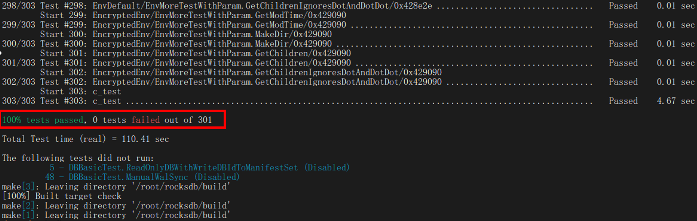
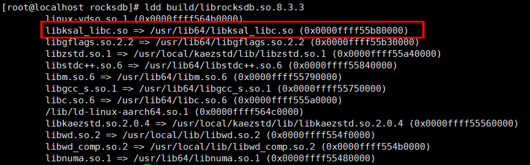
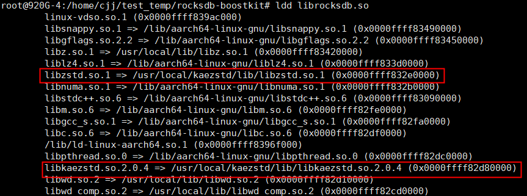

# Installation Guide<a name="EN-US_TOPIC_0000002521559456"></a>

## Environment Requirements<a name="EN-US_TOPIC_0000002551682863"></a>

This document provides guidance based on the Kunpeng server and the openEuler and Debian OSs. Before performing operations, ensure that your software and hardware meet the requirements.

**Hardware Requirements<a name="en-us_topic_0000001217080138_section10273165810425"></a>**

| Project   | Specifications                                             |
|-------|-------------------------------------------------|
| CPU model| Kunpeng 920<br> New Kunpeng 920 processor model<br> Kunpeng 950|

**Software Requirements<a name="section1240364411598"></a>**

| Project     | Version                                                                             |
|---------|---------------------------------------------------------------------------------|
| OS   | openEuler 22.03 LTS SP1 <br> openEuler 22.03 LTS SP2 <br> Debian GNU/Linux 10 |
| RocksDB | 6.1.2 <br> 7.9.2 <br> 8.3.3                                                   |

**Software Packages<a id="section13411942256"></a>**

| Software Package                   | Description                                                                   | How to Obtain                                                                                                                                                                                                            |
|--------------------------|-----------------------------------------------------------------------|------------------------------------------------------------------------------------------------------------------------------------------------------------------------------------------------------------------|
| BoostKit-KSAL_1.10.0.zip | KSAL closed-source algorithm package, which is used to enable Kunpeng acceleration.                            | [Kungpeng community](https://www.hikunpeng.com/developer/download?zhTitle=%E5%88%86%E5%B8%83%E5%BC%8F%E5%AD%98%E5%82%A8&zhSubTitle=%E5%AD%98%E5%82%A8%E7%AE%97%E6%B3%95%E5%8A%A0%E9%80%9F%E5%BA%93&enTitle=SDS&enSubTitle=KSA) |
| KAE-kae2.zip             | KAE source package, which is used to install the KAE driver and KAEZstd (KAE 2.0 applies to openEuler kernel 5.1*x* and Debian kernel 5.15.*x*.)| [Open-source community](https://gitcode.com/boostkit/KAE/tree/kae2)                                                                                                                                                              |

> **Note:**
> 
>Kunpeng Storage Acceleration Library (KSAL) is a Huawei-developed closed-source library. Kunpeng Accelerator Engine (KAE) is a hardware acceleration solution available only on Kunpeng processors.

## Installing the KSAL Closed-Source Algorithm Package<a name="EN-US_TOPIC_0000002520522882"></a>

KSAL provides acceleration packages such as storage CRC, EC, and prefetch algorithms. It uses algorithms optimized for the Kunpeng platform to replace open-source algorithms, improving storage performance.

Hotspot functions, such as CRC and memcpy, exist in RocksDB read/write processes. Using the optimized algorithms can improve the read/write performance of RocksDB.

1. Obtain **BoostKit-KSAL\_1.10.0.zip** by following [Software Packages](#section13411942256) and save it to the `/home` directory.
2. Decompress **BoostKit-KSAL\_1.10.0.zip** in the `/home` directory.

    ```sh
    cd /home
    unzip BoostKit-KSAL_1.10.0.zip
    ```

3. Install the decompressed RPM package.

    ```sh
    rpm -ivh /home/libksal-release-1.10.0.oe1.aarch64.rpm
    ```

4. Check the RPM installation result.

    ```sh
    rpm -qi libksal
    ```

    The command output is as follows:

    ```txt
    Name        : libksal
    Version     : 1.10.0
    Release     : 1
    Architecture: aarch64
    Install Date: Wed 12 Feb 2025 03:25:39 PM CST
    Group       : Unspecified
    Size        : 808257
    License     : GPL
    Signature   : (none)
    Source RPM  : libksal-1.10.0-1.src.rpm
    Build Date  : Mon 16 Dec 2024 02:50:00 PM CST
    Build Host  : buildhost
    Summary     : Kunpeng Storage Acceleration Library
    Description :
    Kunpeng Storage Acceleration Library
    Product Name:           Kunpeng BoostKit
    Product Version:        24.0.0
    Component Name:         BoostKit-KSAL
    Component Version:      1.10.0
    Component AppendInfo:   kunpeng
    ```

KSAL provides acceleration packages such as storage CRC, EC, and prefetch algorithms. It uses algorithms optimized for the Kunpeng platform to replace open-source algorithms, improving storage performance.

## Installing KAEZstd<a name="EN-US_TOPIC_0000002520522886"></a>

### openEuler<a name="EN-US_TOPIC_0000002551722885"></a>

In RocksDB write scenarios, when a large amount of data is written, the background thread needs to compact the data. If the compaction is slow, data writing may be temporarily interrupted. During compaction, a compression algorithm is invoked to compress data. Optimizing the compression algorithm can effectively improve the compaction efficiency and RocksDB write performance.

KAE is a hardware acceleration solution based on the Kunpeng 920 processor. It includes KAE encryption and decryption, KAEZip, KAELz4, and KAEZstd. When RocksDB uses zstd as the compression algorithm during compaction, KAEZstd can be used to accelerate the process.

1. For details about how to apply for and install a license, see [Huawei Server iBMC License User Guide](https://support.huawei.com/enterprise/en/management-software/ibmc-pid-8060757?category=operation-maintenance).

2. Obtain **KAE-kae2.zip** by following [Software Packages](#section13411942256) and save it to the `/home` directory.

3. Decompress **KAE-kae2.zip** in the `/home` directory and go to the KAE source package directory.

    ```sh
    cd /home
    unzip KAE-kae2.zip
    cd KAE-kae2
    ```

4. Install the dependency.

    ```sh
    yum install -y numactl-devel pciutils openssl-devel automake m4 perl libtool zlib lzma lz4 make patch
    yum install -y kernel-devel-5.10.0-216.0.0.115.oe2203sp4.aarch64
    ```

    > **Note:**
    >
    >When installing kernel-devel, run `uname -r` to query the current kernel version. The kernel-devel version must be the same as the current kernel version.

5. In the KAE source package directory, perform the following operations to install KAE modules.
    1. Install the kernel driver.
        1. Run the following command:

            ```sh
            sh build.sh driver
            ```

        2. Check whether the accelerator engine file system exists.

            ```sh
            ll /sys/class/uacce/
            ```

            The command output is as follows:

            ```txt
            lrwxrwxrwx. 1 root root 0 Aug 22 17:14 hisi_hpre-2 -> ../../devices/pci0000:78/0000:78:00.0/0000:79:00.0/uacce/hisi_hpre-2
            lrwxrwxrwx. 1 root root 0 Aug 22 17:14 hisi_hpre-3 -> ../../devices/pci0000:b8/0000:b8:00.0/0000:b9:00.0/uacce/hisi_hpre-3
            lrwxrwxrwx. 1 root root 0 Aug 22 17:14 hisi_sec2-0 -> ../../devices/pci0000:74/0000:74:01.0/0000:76:00.0/uacce/hisi_sec2-0
            lrwxrwxrwx. 1 root root 0 Aug 22 17:14 hisi_sec2-1 -> ../../devices/pci0000:b4/0000:b4:01.0/0000:b6:00.0/uacce/hisi_sec2-1
            lrwxrwxrwx. 1 root root 0 Aug 22 17:14 hisi_zip-4 -> ../../devices/pci0000:74/0000:74:00.0/0000:75:00.0/uacce/hisi_zip-4
            lrwxrwxrwx. 1 root root 0 Aug 22 17:14 hisi_zip-5 -> ../../devices/pci0000:b4/0000:b4:00.0/0000:b5:00.0/uacce/hisi_zip-5
            ```

        3. Check whether the driver is installed.

            ```sh
            lsmod | grep uacce
            ```

            The command output is as follows:

            ```sh
            uacce                  32768  3 hisi_sec2,hisi_qm,hisi_zip
            ```

    2. Install the user-space driver.
        1. Run the following command:

            ```sh
            sh build.sh uadk
            ```

        2. Check whether the installation is successful.

            ```sh
            ll /usr/local/lib/libwd*
            ```

            The command output is as follows:

            ```sh
            -rwxr-xr-x. 1 root root     961 Aug 22 17:23 /usr/local/lib/libwd_comp.la
            lrwxrwxrwx. 1 root root      19 Aug 22 17:23 /usr/local/lib/libwd_comp.so -> libwd_comp.so.2.6.0
            lrwxrwxrwx. 1 root root      19 Aug 22 17:23 /usr/local/lib/libwd_comp.so.2 -> libwd_comp.so.2.6.0
            -rwxr-xr-x. 1 root root  377872 Aug 22 17:23 /usr/local/lib/libwd_comp.so.2.6.0
            -rwxr-xr-x. 1 root root     973 Aug 22 17:23 /usr/local/lib/libwd_crypto.la
            lrwxrwxrwx. 1 root root      21 Aug 22 17:23 /usr/local/lib/libwd_crypto.so -> libwd_crypto.so.2.6.0
            lrwxrwxrwx. 1 root root      21 Aug 22 17:23 /usr/local/lib/libwd_crypto.so.2 -> libwd_crypto.so.2.6.0
            -rwxr-xr-x. 1 root root  715616 Aug 22 17:23 /usr/local/lib/libwd_crypto.so.2.6.0
            -rwxr-xr-x. 1 root root     907 Aug 22 17:23 /usr/local/lib/libwd.la
            lrwxrwxrwx. 1 root root      14 Aug 22 17:23 /usr/local/lib/libwd.so -> libwd.so.2.6.0
            lrwxrwxrwx. 1 root root      14 Aug 22 17:23 /usr/local/lib/libwd.so.2 -> libwd.so.2.6.0
            -rwxr-xr-x. 1 root root 1342080 Aug 22 17:23 /usr/local/lib/libwd.so.2.6.0
            ```

    3. Compile and install KAEZstd.
        1. Run the following command to install KAEZstd:

            ```sh
            sh build.sh zstd
            ```

        2. Check whether the installation is successful.

            ```sh
            ll /usr/local/kaezstd/
            ```

            If the following information is displayed, the installation is successful:

            ```txt
            drwxr-xr-x 2 root root 4096 Jun 11 22:29 bin
            drwxr-xr-x 2 root root 4096 Jun 11 22:29 include
            drwxr-xr-x 3 root root 4096 Jun 11 22:29 lib
            drwxr-xr-x 3 root root 4096 Jun 11 22:29 share
            ```

        3. View generated files.

            ```sh
            ll /usr/local/kaezstd/bin/
            ```

            The command output is as follows:

            ```txt
            lrwxrwxrwx 1 root root      4 Jun 11 22:29 unzstd -> zstd
            -rwxr-xr-x 1 root root 986192 Jun 11 22:29 zstd
            lrwxrwxrwx 1 root root      4 Jun 11 22:29 zstdcat -> zstd
            -rwxr-xr-x 1 root root   3869 Jun 11 22:29 zstdgrep
            -rwxr-xr-x 1 root root     30 Jun 11 22:29 zstdless
            lrwxrwxrwx 1 root root      4 Jun 11 22:29 zstdmt -> zstd
            ```

6. Check the number of hardware device queues to determine whether the program has invoked KAE to accelerate the zstd algorithm. For example, run the following command to check the number of queues corresponding to the hisi\_zip driver module. By default, the number is 256.

    ```sh
    watch -n 0.2 cat /sys/class/uacce/hisi_zip-*/available_instances
    ```

    The command output is as follows:

    ```txt
    Every 0.2s: cat /sys/class/uacce/hisi_zip-0/available_instances/sys/class/uacce/hisi_zip...  localhost.localdomain:
    256
    256
    256
    256
    ```

    Start another window and perform operations in [Function Test](#section1). If the number of queues changes, hardware-based KAE compression acceleration is enabled.

    ```txt
    Every 0.2s: cat /sys/class/uacce/hisi_zip-0/available_instances/sys/class/uacce/hisi_zip...  localhost.localdomain:
    256
    254
    256
    256
    ```

In RocksDB write scenarios, when a large amount of data is written, the background thread needs to compact the data. If the compaction is slow, data writing may be temporarily interrupted. During compaction, a compression algorithm is invoked to compress data. Optimizing the compression algorithm can effectively improve the compaction efficiency and RocksDB write performance.

### Debian<a name="EN-US_TOPIC_0000002520682866"></a>

In RocksDB write scenarios, when a large amount of data is written, the background thread needs to compact the data. If the compaction is slow, data writing may be temporarily interrupted. During compaction, a compression algorithm is invoked to compress data. Optimizing the compression algorithm can effectively improve the compaction efficiency and RocksDB write performance.

KAE is a hardware acceleration solution based on the Kunpeng 920 processor. It includes KAE encryption and decryption, KAEZip, and KAEZstd. When RocksDB uses zstd as the compression algorithm during compaction, KAEZstd can be used to accelerate the process.

1. For details about how to apply for and install a license, see [Huawei Server iBMC License User Guide](https://support.huawei.com/enterprise/en/management-software/ibmc-pid-8060757?category=operation-maintenance).

2. Obtain **KAE-kae2.zip** by following [Software Packages](#section13411942256) and save it to the `/home` directory.

3. Decompress **KAE-kae2.zip** in the `/home` directory and go to the KAE source package directory.

    ```sh
    cd /home
    unzip KAE-kae2.zip
    cd KAE-kae2
    ```

4. Install the dependency.

    ```sh
    apt install -y autoconf automake libtool m4 pkg-config dh-autoreconf libnuma-dev cmake dracut make liblz4-dev
    ```

5. In the KAE source package directory, perform the following operations to install KAE modules.
    1. Install the kernel driver.
        1. Run the following command:

            ```sh
            bash build.sh driver
            ```

            > **Note:**
            > 
            >If an error is reported because the curve25519-related module is not enabled during kernel compilation, [modify the configuration](https://gitcode.com/boostkit/KAE/commit/eea16ad40e2defdaeb3bfc05d5dfc8b77b8b1798?ref=dev_kae2_forByteDance).

        2. Check whether the accelerator engine file system exists.

            ```sh
            ll /sys/class/uacce/
            ```

            The command output is as follows:

            ```txt
            lrwxrwxrwx. 1 root root 0 Aug 22 17:14 hisi_hpre-2 -> ../../devices/pci0000:78/0000:78:00.0/0000:79:00.0/uacce/hisi_hpre-2
            lrwxrwxrwx. 1 root root 0 Aug 22 17:14 hisi_hpre-3 -> ../../devices/pci0000:b8/0000:b8:00.0/0000:b9:00.0/uacce/hisi_hpre-3
            lrwxrwxrwx. 1 root root 0 Aug 22 17:14 hisi_sec2-0 -> ../../devices/pci0000:74/0000:74:01.0/0000:76:00.0/uacce/hisi_sec2-0
            lrwxrwxrwx. 1 root root 0 Aug 22 17:14 hisi_sec2-1 -> ../../devices/pci0000:b4/0000:b4:01.0/0000:b6:00.0/uacce/hisi_sec2-1
            lrwxrwxrwx. 1 root root 0 Aug 22 17:14 hisi_zip-4 -> ../../devices/pci0000:74/0000:74:00.0/0000:75:00.0/uacce/hisi_zip-4
            lrwxrwxrwx. 1 root root 0 Aug 22 17:14 hisi_zip-5 -> ../../devices/pci0000:b4/0000:b4:00.0/0000:b5:00.0/uacce/hisi_zip-5
            ```

        3. Check whether the driver is installed.

            ```sh
            lsmod | grep uacce
            ```

            The command output is as follows:

            ```txt
            uacce                  32768  3 hisi_sec2,hisi_qm,hisi_zip
            ```

    2. Install the user-space driver.
        1. Run the following command:

            ```sh
            bash build.sh uadk
            ```

        2. Check whether the installation is successful.

            ```sh
            ll /usr/local/lib/libwd*
            ```

            The command output is as follows:

            ```txt
            -rwxr-xr-x. 1 root root     961 Aug 22 17:23 /usr/local/lib/libwd_comp.la
            lrwxrwxrwx. 1 root root      19 Aug 22 17:23 /usr/local/lib/libwd_comp.so -> libwd_comp.so.2.6.0
            lrwxrwxrwx. 1 root root      19 Aug 22 17:23 /usr/local/lib/libwd_comp.so.2 -> libwd_comp.so.2.6.0
            -rwxr-xr-x. 1 root root  377872 Aug 22 17:23 /usr/local/lib/libwd_comp.so.2.6.0
            -rwxr-xr-x. 1 root root     973 Aug 22 17:23 /usr/local/lib/libwd_crypto.la
            lrwxrwxrwx. 1 root root      21 Aug 22 17:23 /usr/local/lib/libwd_crypto.so -> libwd_crypto.so.2.6.0
            lrwxrwxrwx. 1 root root      21 Aug 22 17:23 /usr/local/lib/libwd_crypto.so.2 -> libwd_crypto.so.2.6.0
            -rwxr-xr-x. 1 root root  715616 Aug 22 17:23 /usr/local/lib/libwd_crypto.so.2.6.0
            -rwxr-xr-x. 1 root root     907 Aug 22 17:23 /usr/local/lib/libwd.la
            lrwxrwxrwx. 1 root root      14 Aug 22 17:23 /usr/local/lib/libwd.so -> libwd.so.2.6.0
            lrwxrwxrwx. 1 root root      14 Aug 22 17:23 /usr/local/lib/libwd.so.2 -> libwd.so.2.6.0
            -rwxr-xr-x. 1 root root 1342080 Aug 22 17:23 /usr/local/lib/libwd.so.2.6.0
            ```

    3. Compile and install KAEZstd.
        1. Run the following command to install KAEZstd:

            ```sh
            bash build.sh zstd
            ```

        2. Check whether the installation is successful.

            ```sh
            ll /usr/local/kaezstd/
            ```

            If the following information is displayed, KAEZstd is installed:

            ```txt
            drwxr-xr-x 2 root root 4096 Jun 11 22:29 bin
            drwxr-xr-x 2 root root 4096 Jun 11 22:29 include
            drwxr-xr-x 3 root root 4096 Jun 11 22:29 lib
            drwxr-xr-x 3 root root 4096 Jun 11 22:29 share
            ```

        3. View generated files.

            ```sh
            ll /usr/local/kaezstd/bin/
            ```

            The command output is as follows:

            ```txt
            lrwxrwxrwx 1 root root      4 Jun 11 22:29 unzstd -> zstd
            -rwxr-xr-x 1 root root 986192 Jun 11 22:29 zstd
            lrwxrwxrwx 1 root root      4 Jun 11 22:29 zstdcat -> zstd
            -rwxr-xr-x 1 root root   3869 Jun 11 22:29 zstdgrep
            -rwxr-xr-x 1 root root     30 Jun 11 22:29 zstdless
            lrwxrwxrwx 1 root root      4 Jun 11 22:29 zstdmt -> zstd
            ```

6. Check the number of hardware device queues to determine whether the program has invoked KAE to accelerate the zstd algorithm. For example, run the following command to check the number of queues corresponding to the hisi\_zip driver module. By default, the number is 256.

    ```sh
    watch -n 0.2 cat /sys/class/uacce/hisi_zip-*/available_instances
    ```

    The command output is as follows:

    ```txt
    Every 0.2s: cat /sys/class/uacce/hisi_zip-0/available_instances/sys/class/uacce/hisi_zip...  localhost.localdomain:
    256
    256
    256
    256
    ```

    Start another window and perform operations in [db_bench Function Test](#section1). If the number of queues changes, hardware-based KAE compression acceleration is enabled.

    ```txt
    Every 0.2s: cat /sys/class/uacce/hisi_zip-0/available_instances/sys/class/uacce/hisi_zip...  localhost.localdomain:
    256
    254
    256
    256
    ```

In RocksDB write scenarios, when a large amount of data is written, the background thread needs to compact the data. If the compaction is slow, data writing may be temporarily interrupted. During compaction, a compression algorithm is invoked to compress data. Optimizing the compression algorithm can effectively improve the compaction efficiency and RocksDB write performance.

## Compiling and Installing RocksDB<a name="EN-US_TOPIC_0000002520682864"></a>

### openEuler<a name="EN-US_TOPIC_0000002551722883"></a>

This section describes how to compile and install RocksDB 6.1.2 and 8.3.3. RocksDB 8.3.3 is used as an example.

1. Install the dependency.

    ```sh
    yum install -y cmake gcc gcc-c++ gflags-devel libstdc++-devel zstd-devel
    ```

2. Obtain the RocksDB source code and apply the patch.

   ```sh
   git clone https://github.com/facebook/rocksdb.git
   cd rocksdb
   git checkout 791a7fe4023ac795072a9e0cbfc679a3764a2ba0
   wget https://gitcode.com/boostkit/rocksdb/blob/master/rocksdb-8.3.3-kae_zstd.patch
   git apply rocksdb-8.3.3-kae_zstd.patch
   ```

3. Perform a unit test.

    ```sh
    sh build.sh UTONLY
    ```

    The test is successful if the following information is displayed.

    

4. Compile RocksDB in Release mode.

    ```sh
    sh build.sh
    ```

    - By default, the Release mode is used. You can specify the compilation mode to Debug, RelWithDebInfo, or Release as required.

        ```sh
        sh build.sh Release
        ```

    - By default, **build.sh** enables all Kunpeng acceleration features, including KSAL and KAEZstd. You can add options to disable unnecessary features.

        ```sh
        sh build.sh Release DISABLE_KSAL DISABLE_KAEZSTD
        ```

        - `DISABLE_KSAL` indicates that KSAL is disabled.
        - `DISABLE_KAEZSTD` indicates that KAEZstd is disabled.

5. After the compilation, run the following command to check whether required features are enabled:

    ```sh
    ldd build/librocksdb.so.8.3.3
    ```

    - KSAL has been enabled if the following information is displayed:

        

    - KAEZstd has been enabled if the following information is displayed:

        

6. Install RocksDB.

    ```sh
    cd build
    make install
    ```

7. Test the performance.

    ```sh
    cd ../script
    sh test_perf_all.sh
    ```

    After the execution is complete, you can view performance data in the `rocksdb/test_data` directory.

    > **Note:**
    >It takes about 10 hours to execute all test cases. You can change the key-value size in line 8 and the number of databases in line 13 to adjust execution time or modify test cases. The default read/write path is `/mnt/rocksdb_data/test`. To change the path, edit the second line basedir in the `test_perf_all.sh` script to the specified path. Before running the script, ensure that the path is available.
    >To mount a device to a specified path, run the following commands (replace **nvme0n1** as required):
>
    >```sh
    >mkfs.ext4 /dev/nvme0n1
    >mount /dev/nvme0n1 /mnt/rocksdb_data/test
    >```

### Debian<a name="EN-US_TOPIC_0000002520522884"></a>

This section describes how to compile and install RocksDB 6.1.2.

1. Install the dependency.

    ```sh
    apt install -y libsnappy-dev libzstd-dev liblz4-dev libgflags-dev libbison-dev make
    ```

2. Obtain the RocksDB source code and apply the patch.

   ```sh
   git clone https://github.com/facebook/rocksdb.git
   cd rocksdb
   git checkout 2b38e2dd6602a17a2010308580fd5d8c91dea650
   wget https://gitcode.com/boostkit/rocksdb/blob/master/6.1.2-optimization.patch
   git apply 6.1.2-optimization.patch
   ```

3. Compile RocksDB in Release mode.

    ```sh
    bash build.sh
    ```

    > **Note:**
    >
    >- During compilation, ensure that the GNU Assembler version is 2.41 or later.
    >- By default, the Release mode is used to compile **build.sh**. You can specify the compilation mode to Debug, RelWithDebInfo, or Release as required. For example, use the following command to specify the Release mode:
    >
    >```sh
    >bash build.sh Release
    >```

4. Enable features.
    1. After the compilation is complete, run the following command to enable KAEZstd:

        ```sh
        export LD_LIBRARY_PATH=/usr/local/kaezstd/lib:/usr/local/lib:$LD_LIBRARY_PATH
        ```

    2. Check whether the feature is enabled.

        ```sh
        ldd librocksdb.so
        ```

        KAEZstd has been enabled if the following information is displayed:

        

5. Install RocksDB.

    ```sh
    make install
    ```

6. Use the test tool db\_bench to test the functions.<a id="section1"></a>

    ```sh
    ./db_bench --compression_type=zstd
    ```
