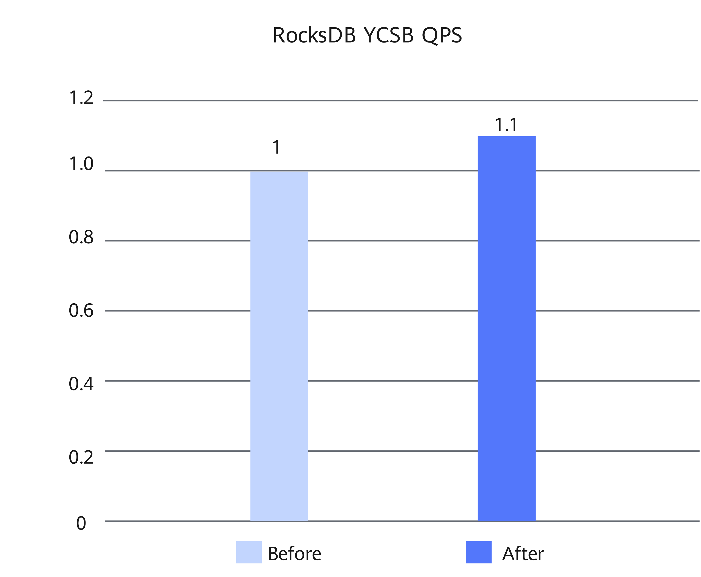

# RocksDB 6.26.1 Memory Allocation Optimization Feature Guide

<!-- md-trans-meta sourceCommit=d70fbb411c921cba0ce6bde35a94ac7ed5623923 translatedAt=2026-09-14T02:18:02.147Z pushedAt=2026-09-15T06:36:59.475Z -->

## Feature Description

### Introduction

This document describes the method, environment requirements, and verification process for optimizing memory allocation in RocksDB via the KQMalloc memory allocator.
As an embedded key-value storage engine, RocksDB frequently allocates and frees memory during operations such as reads/writes, caching, MemTable access, flush, and compaction, which can easily cause additional overhead and contention on the allocation path. It is therefore necessary to reduce memory allocation cost and improve memory management efficiency under concurrency.
This feature does not modify RocksDB application code. Instead, it switches the process's memory allocator via scripts and link configuration. This feature can be used independently or in combination with the GCC compilation optimization feature.

### Principles

RocksDB, as an embedded key-value storage engine, runs within the process of an upper-layer application or a test program. The memory allocation optimization feature uses the KQMalloc multi-threaded dynamic library to replace the default memory allocator of the process, covering the standard memory allocation requests generated by RocksDB on paths such as reads/writes, caching, MemTable access, flush, and compaction.
KQMalloc reduces the small-object allocation latency and concurrency contention through thread-local caching and multi-level lock-free caching, alleviates memory fragmentation through fine-grained size classification, and lowers TLB misses and page management overhead through transparent huge pages, lazy release, and dirty page reclamation.

## Verified Environments

This document provides guidance based on specific environments. Before performing operations, ensure that your hardware and software meet the requirements.

**Table 1** Hardware requirement

| Item | Specification |
| ---- | ---- |
| CPU | Kunpeng 950 processor |

**Table 2** KQMalloc binary usage environment<a id="kqmalloc-binary-usage-environment"></a>

| OS | CPU | Compiler |
| -------- | ------- | ------ |
| openEuler 20.03 LTS SP1 | Kunpeng 920 series | GCC 7.3.0/BiSheng 4.2.0 |
| openEuler 22.03 LTS SP3 | Kunpeng 920 series | GCC 10.3.1/BiSheng 4.2.0 |
| openEuler 24.03 LTS SP3 | Kunpeng 950 | GCC 12.3.1/Clang 14.0.6 |

The KQMalloc binary runtime environment requires glibc 2.34 or later. For detailed installation requirements, see [KQMalloc Installation Guide](https://www.hikunpeng.com/document/detail/en/kunpengaccel/system-lib/kqmalloc/docs/en/kqmalloc/installation_guide.md).

**Table 3** OS and software requirements<a id="os-and-software-requirements"></a>

| Item | Requirement | How to Obtain |
| ----------- | ------------------------------------------------------------ | ------------------------------------------------------------ |
| OS | openEuler 24.03 LTS SP3 | [Link](https://repo.huaweicloud.com/openeuler/openEuler-24.03-LTS-SP3/ISO/aarch64/openEuler-24.03-LTS-SP3-everything-aarch64-dvd.iso) |
| GCC | 12.3.1 | Provided with openEuler 24.03 LTS SP3. |
| JDK | 11 | Install it using Yum on openEuler 24.03 LTS SP3 when the network connection is normal. |
| RocksDB | 6.26.1 | [Link](https://github.com/facebook/rocksdb/tree/v6.26.1) |
| Optimization feature patches | Patches `0001` to `0005` | [Link](https://gitcode.com/boostkit/rocksdb/tree/master/src/rocksdb-6.26.1/feature-patches) |
| KQMalloc binary | v0.22.0 | [Link](https://repo.boostkit.osinfra.cn/boostcore/kqmalloc/release/v0.22.0/) |

## Feature Installation and Usage

1. Use Git to clone RocksDB, switch to version 6.26.1, and place it in the `$HOME` directory.

   ```bash
   cd $HOME
   git clone https://github.com/facebook/rocksdb.git
   cd rocksdb/
   git checkout v6.26.1
   ```

2. Install dependencies using Yum and configure environment variables.

   ```bash
   yum install -y git make gcc-c++ snappy snappy-devel zlib zlib-devel bzip2 bzip2-devel lz4 lz4-devel zstd zstd-devel java java-devel java-11-openjdk-devel gflags gflags-devel flex python maven

   export JAVA_HOME=/usr/lib/jvm/java-11
   export PATH=$JAVA_HOME/bin:$PATH
   ```

3. (Optional) Obtain the patch files for the optimization feature and upload them to the `$HOME` directory.

   For details about how to obtain the patches, see [Table 3](#os-and-software-requirements).

4. (Optional) Go to the `$HOME/rocksdb` directory and apply the `0001` to `0005` patches in sequence according to the actual file names in the `feature-patches` directory. If no output is displayed, the patches are applied successfully.

5. Compile the RocksDB JAR packages and related dynamic libraries to use the memory allocation optimization feature.

   1. Compile the JAR packages and related dynamic libraries of RocksDB.

      ```bash
      cd "$HOME/rocksdb"
      make clean
      PORTABLE=1 DEBUG_LEVEL=0 make rocksdbjava -j$nproc DISABLE_WARNING_AS_ERROR=1 DISABLE_JEMALLOC=1
      ```

   2. Replace the JAR package in the local Maven repository.

      ```bash
      cd "$HOME/rocksdb"
      cp java/target/rocksdbjni-6.26.1-linux64.jar \
         "~/.m2/repository/org/rocksdb/rocksdbjni/6.26.1/rocksdbjni-6.26.1.jar"
      cp java/target/rocksdbjni-6.26.1-linux64.jar.sha1 \
         "~/.m2/repository/org/rocksdb/rocksdbjni/6.26.1/rocksdbjni-6.26.1.jar.sha1"
      ```

6. Obtain the KQMalloc binary memory library.

   Based on the current OS, CPU type, and compiler, download `kqmalloc-v0.22.0.tar.gz` as described in [Table 3](#os-and-software-requirements), and decompress it to the `$HOME/kqmalloc` directory. For details about the environment for using the KQMalloc binary, see [KQMalloc binary usage environment](#kqmalloc-binary-usage-environment).

   ```bash
   cd "$HOME"
   wget https://repo.boostkit.osinfra.cn/boostcore/kqmalloc/release/v0.22.0/kqmalloc-v0.22.0.tar.gz
   mkdir -p kqmalloc
   tar -xzf kqmalloc-v0.22.0.tar.gz -C kqmalloc --strip-components=1
   ```

7. Use `LD_PRELOAD` to load the KQMalloc memory library and run the performance test.

   ```bash
   export LD_PRELOAD="$HOME/kqmalloc/HIP12/lib/libkqmalloc.so"

   cd "$HOME/YCSB_RUN/YCSB_RUN/ycsb-rocksdb-binding-0.18.0-SNAPSHOT"
   taskset -c 0-15 ./bin/ycsb run rocksdb -s \
   -P workloads/workloada \
   -p fieldlength=256 -p fieldcount=1 \
   -p recordcount=100000000 -p operationcount=100000000 \
   -p rocksdb.dir="$HOME/data/workload_data/" \
   -p rocksdb.optionsfile="$HOME/data/configs/dbsnappyrun.ini" \
   -p rocksdb.cfs=default -p table=default -threads 5
   ```

   The combined use of GCC compilation optimization and memory allocation optimization yields an average 10% performance improvement across YCSB benchmark workloads a to f. [Figure 1](#performance-comparison-before-and-after-enabling-the-two-features) shows the comparison before and after optimization.

   **Figure 1** Performance comparison before and after enabling the two features<a id="performance-comparison-before-and-after-enabling-the-two-features"></a>

   

## Security Check and Hardening

Address space layout randomization (ASLR) is a security technology against buffer overflow. It randomizes the layout of linear areas such as heap, stack, and shared library mapping to make it difficult for attackers to predict target addresses and directly locate code, thereby preventing overflow attacks.

```bash
echo 2 > /proc/sys/kernel/randomize_va_space
cat /proc/sys/kernel/randomize_va_space
```


## Change History

|Version| Date   | Description         |
|----------| ---------- | ---------------- |
|01| 2026-09-30 | This is the first official release. |
