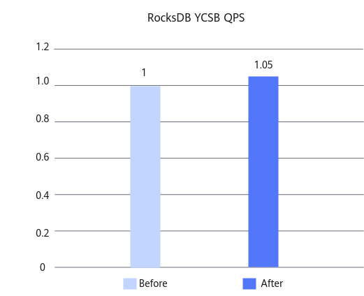

# RocksDB Filter Optimization Feature Guide

## Feature Description<a name="EN-US_TOPIC_0000002543719149"></a>

### Overview<a name="EN-US_TOPIC_0000002543639153"></a>

This document describes the principles, installation, and usage of the filter optimization feature for RocksDB.

RocksDB is a high-performance, embedded, and persistent key-value storage engine developed by Meta (formerly Facebook). It is implemented based on C++ and can be used as an embedded engine or as a storage database in client-server (C/S) mode. RocksDB uses the Log-Structured Merge-Tree (LSM-Tree) data structure to convert random writes into sequential writes, significantly improving the write throughput. This data structure is especially suitable for high-concurrency write scenarios. RocksDB also excels in point query and range query, and is widely used in scenarios such as databases, cache systems, and real-time data processing.

When RocksDB searches for records in an SST file, the accuracy of the RocksDB Bloom filter algorithm directly affects the drive I/O and CPU overhead. The static hash distribution policy is insensitive to hot data. As a result, data blocks that are frequently accessed may be incorrectly identified due to sparse bitmaps. By improving the Bloom filter algorithm, hot data can occupy more bits for a higher filtering accuracy, thus reducing invalid drive reads and improving performance.

### Principles<a name="EN-US_TOPIC_0000002512119226"></a>

This feature uses the intelligent Bloom filter to reduce invalid I/O, improving the overall performance and system stability of RocksDB on Kunpeng servers.

**Filter Optimization<a name="section398327155517"></a>**

This feature optimizes the Bloom filter while ensuring the overall balance of the system. In hot data scenarios, the bitmap size of the Bloom filter is dynamically increased to improve the accuracy and reduce the false positive rate. In addition, a proper upper limit is set to prevent excessive memory usage, balancing performance and resource consumption. This optimization significantly improves the query efficiency in hot data access.

In RocksDB, the Bloom filter is used to quickly determine whether a key exists in an SST file, effectively avoiding unnecessary drive I/O. GET operations access the Bloom filter frequently. Therefore, the tradeoff between the accuracy and memory overhead of the Bloom filter is critical. This optimization achieves a better balance between accuracy and memory overhead, significantly improving the throughput in hot data scenarios.

## Verified Environments<a name="EN-US_TOPIC_0000002512279202"></a>

This document provides guidance based on specific environments. Before performing operations, ensure that your hardware and software meet the requirements.

**Table 1** Hardware requirement<a id="hardware-requirement"></a>

|Item|Specifications|
|--|--|
|CPU|New Kunpeng 920 processor model or Kunpeng 950 processor|

**Table 2** OS and software requirements<a id="os-and-software-requirements"></a>

|Item|Version|How to Obtain|
|--|--|--|
|OS|openEuler 22.03 LTS SP4|[Link](https://repo.huaweicloud.com/openeuler/openEuler-22.03-LTS-SP4/ISO/aarch64/openEuler-22.03-LTS-SP4-everything-aarch64-dvd.iso)|
|OS|openEuler 24.03 LTS SP3|[Link](https://repo.huaweicloud.com/openeuler/openEuler-24.03-LTS-SP3/ISO/aarch64/openEuler-24.03-LTS-SP3-everything-aarch64-dvd.iso)|
|RocksDB|6.1.2|[Link](https://github.com/facebook/rocksdb/tree/v6.1.2)|
|GCC|10.3.1|Provided with openEuler 22.03 LTS SP4|
|Java|1.8.0|Install it using Yum on openEuler 22.03 LTS SP4 when the network connection is normal.|
|Patch file|0002-filter_opt_6_1_2_final.patch|[Link](https://gitcode.com/boostkit/rocksdb/blob/rocksdb-v6.1.2-patch/0002-filter_opt_6_1_2_final.patch)|

## Feature Installation and Usage<a name="EN-US_TOPIC_0000002543719151"></a>

The RocksDB filter optimization feature is developed for RocksDB 6.1.2 and is provided as a patch file. To install and use this feature, apply the patch file to the RocksDB source code and then compile RocksDB.

1. Use `git` to clone RocksDB, select version 6.1.2, and place it in the home directory `~`.

    ```shell
    cd ~
    git clone https://github.com/facebook/rocksdb.git
    cd rocksdb/
    git checkout v6.1.2
    ```

2. Install dependencies using Yum and configure environment variables.

    ```shell
    yum install -y git make gcc-c++ snappy snappy-devel zlib zlib-devel bzip2 bzip2-devel lz4 lz4-devel zstd zstd-devel java java-devel java-11-openjdk-devel gflags gflags-devel flex python maven
    
    export JAVA_HOME=/usr/lib/jvm/java-1.8.0
    export PATH=$JAVA_HOME/bin:$PATH
    ```

3. Obtain the patch file of the optimization feature and upload it to the home directory `~`.

    For details about how to obtain the patch, see [**Table 2**](#os-and-software-requirements).

4. Apply the optimization feature patch. If no command output is displayed, the patch is successfully applied.

    ```shell
    cd ~/rocksdb
    git apply --whitespace=nowarn < ~/0002-filter_opt_6_1_2_final.patch
    ```

5. Compile the RocksDB JAR packages and related dynamic libraries to use the optimization feature.
    1. Fix the bug in the source code when the JAR packages and related dynamic libraries are compiled.
        1. Access the path to the native code to be modified.

            ```shell
            cd ~/rocksdb
            ```

        2. Open the `BlockBasedTableConfig.java` file.

            ```shell
            vim java/src/main/java/org/rocksdb/BlockBasedTableConfig.java
            ```

        3. Press `i` to enter the insert mode and change `true` to `false` in line 38.

            ```txt
            # Change true to false in line 38.
            verifyCompression = false;
            ```

        4. Press `Esc`, type `:wq!`, and press `Enter` to save the file and exit.

    2. Compile the JAR packages and related dynamic libraries of RocksDB.

        ```txt
        PORTABLE=1 DEBUG_LEVEL=0 make rocksdbjava -j`nproc` DISABLE_WARNING_AS_ERROR=1 DISABLE_JEMALLOC=1
        ```

    3. (Optional) If an error is reported during the compilation, indicating that JAR packages are missing, clear the files, manually download the missing JAR packages, and then perform compilation again.

        ```shell
        cd ~/rocksdb
        make clean
        mkdir -p java/test-libs
        cd java/test-libs
        wget https://repo1.maven.org/maven2/org/assertj/assertj-core/1.7.1/assertj-core-1.7.1.jar --no-check-certificate
        wget https://repo1.maven.org/maven2/cglib/cglib/2.2.2/cglib-2.2.2.jar --no-check-certificate 
        wget https://repo1.maven.org/maven2/org/mockito/mockito-all/1.10.19/mockito-all-1.10.19.jar --no-check-certificate
        wget https://repo1.maven.org/maven2/org/hamcrest/hamcrest-core/1.3/hamcrest-core-1.3.jar --no-check-certificate
        wget https://repo1.maven.org/maven2/junit/junit/4.12/junit-4.12.jar --no-check-certificate
        ```

6. (Optional) Perform the Yahoo! Cloud Serving Benchmark (YCSB) test to measure the performance improvement when the feature is enabled. For details about the test procedure, see [YCSB Test Guide](https://www.hikunpeng.com/document/detail/en/kunpengdbs/testguide/tstg/kunpengycsbformong_11_0001.html).<br>The RocksDB CRC32 and filter optimization features can improve the performance of workloada and workloadc by 5% on average with a configuration of 16 vCPUs. [**Figure 1**](#performance-comparison-before-and-after-the-two-optimization-features-are-enabled) shows the performance comparison before and after the optimization.

    **Figure 1** Performance comparison before and after the two optimization features are enabled<a name="fig1620685015314"></a><a id="performance-comparison-before-and-after-the-two-optimization-features-are-enabled"></a><br>
    

## Security Check and Hardening<a name="EN-US_TOPIC_0000002549283247"></a>

Address space layout randomization (ASLR) is a security technology against buffer overflow. It randomizes the layout of linear areas such as heap, stack, and shared library mapping to make it difficult for attackers to predict target addresses and directly locate code, thereby preventing overflow attacks.

```shell
echo 2 >/proc/sys/kernel/randomize_va_space
```


## Change History<a name="EN-US_TOPIC_0000002543639155"></a>

|Date|Description|
|--|--|
|2026-03-30|This is the first official release.|
