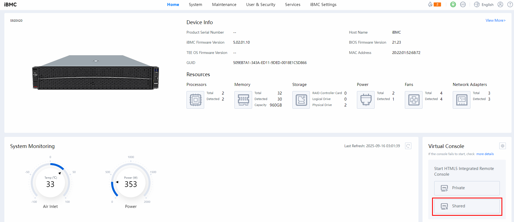
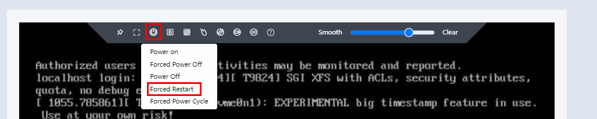
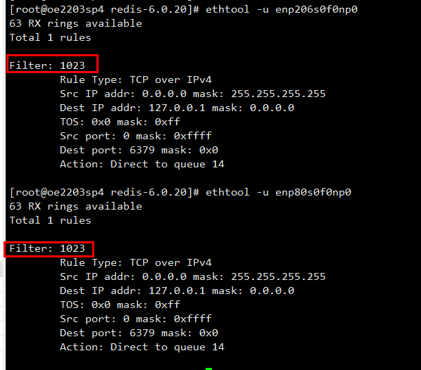
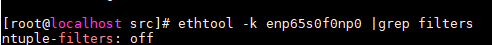

# RocksDB Proxy (Kvrocks) Network Multipathing Feature Guide

## Feature Description<a name="EN-US_TOPIC_0000002512120258"></a>

### Overview<a name="EN-US_TOPIC_0000002543640185"></a>

This document describes how to set up an environment, and enable and test the RocksDB proxy (Kvrocks) network multipathing feature on the openEuler OS running on the new Kunpeng 920 processor model.

### Principles<a name="EN-US_TOPIC_0000002543720175"></a>

In Internet service deployments, a single server typically hosts multiple containerized services. When a service process handles network traffic, the CPU core processing NIC interrupts often resides on a different NUMA node than the service process itself, resulting in increased response latency due to cross-NUMA memory access.

The RocksDB proxy (Kvrocks) network multipathing feature addresses this by strategically binding NIC queues to CPUs across different NUMA nodes. By analyzing traffic patterns of specific service processes, it ensures that network traffic of each process is preferentially handled by NIC queues on its local NUMA node, thereby establishing affinity between service processes and their network interrupts.

### Constraints<a name="EN-US_TOPIC_0000002543640186"></a>

The RocksDB proxy (Kvrocks) network multipathing feature requires that NICs support the Flow Director (FDIR) function. For details about how to check whether the NIC supports the FDIR function, see [Reference Information](#reference-information).

### Application Scenarios<a name="EN-US_TOPIC_0000002543640187"></a>

The RocksDB proxy (Kvrocks) network multipathing feature is applicable to physical machines or containers with high service network loads. It enables NUMA affinity scheduling between service processes and their network interrupts, improving memory access efficiency and service performance.

## Setting Up the Environment<a name="EN-US_TOPIC_0000002512280240"></a>

### Environment Requirements<a name="EN-US_TOPIC_0000002512280241"></a>

This document provides guidance based on the Kunpeng server and openEuler OS. Before performing operations, ensure that your hardware and software meet the requirements.

**Table 1** Hardware requirements<a id="hardware-requirements"></a>

|Item|Specifications|
|--|--|
|CPU|New Kunpeng 920 processor model or Kunpeng 950 processor|
|NIC|2 × 25GE NIC|

**Table 2** OS and software requirements<a id="os-and-software-requirements"></a>

|Item|Version|How to Obtain|
|--|--|--|
|OS|openEuler 22.03 LTS SP4 for Arm<br>openEuler 24.03 LTS SP3 for Arm|[Link](https://repo.openeuler.org/openEuler-22.03-LTS-SP4/ISO/aarch64/openEuler-22.03-LTS-SP4-everything-aarch64-dvd.iso)<br>[Link](https://repo.openeuler.org/openEuler-24.03-LTS-SP3/ISO/aarch64/openEuler-24.03-LTS-SP3-everything-aarch64-dvd.iso)|
|Kvrocks|2.2.0|[Link](https://github.com/apache/kvrocks/archive/refs/tags/v2.2.0.zip)|
|Affinity kernel of the RocksDB proxy (Kvrocks) network multipathing feature|kernel-5.10.0-301.0.0.204.oe2203sp4.aarch64.rpm or later<br>kernel-6.6.0-135.0.0.113.oe2403sp3.aarch64.rpm or later|Click the [link](https://repo.openeuler.org/openEuler-22.03-LTS-SP4/update/aarch64/Packages/), search for <code>kernel-5.10.0</code> on the page, and download the latest kernel version. The kernel file name is in the format of <code>kernel-5.10.0-xxx.0.0.xxx.oe2203sp4.aarch64.rpm</code>, where <code>xxx</code> indicates the version. A larger value of <code>xxx</code> indicates a later version.<br>Click the [link](https://repo.openeuler.org/openEuler-24.03-LTS-SP3/update/aarch64/Packages/), search for <code>kernel-6.6.0</code> on the page, and download the latest kernel version. The kernel file name is in the format of <code>kernel-6.6.0-xxx.0.0.xxx.oe2403sp3.aarch64.rpm</code>, where <code>xxx</code> indicates the version. A larger value of <code>xxx</code> indicates a later version.|

> **NOTE:**
>
>- The following uses the new Kunpeng 920 processor and openEuler 22.03 LTS SP4 as an example.<br>
>- The feature supports the following network configuration scenarios: physical machine, container IPVLAN mode, container host mode, and VM VF NIC passthrough.<br>
>- If the OS uses an openEuler kernel, kernel-5.10.0-301.0.0.204 or later is required.<br>
>- If the OS uses a non-openEuler kernel, the RocksDB proxy (Kvrocks) network multipathing feature must be adapted.

### Replacing the Kernel<a name="EN-US_TOPIC_0000002512280242"></a>

The RocksDB proxy (Kvrocks) network multipathing feature requires a specific kernel version. Therefore, you need to install a compatible OS kernel in advance. After the kernel is installed, you can use the OS GRUB tool to change the default kernel boot entry, or use the iBMC remote management interface to replace the default kernel with the kernel that supports the feature.

#### Using the CLI

1. Download the kernel RPM package that supports this feature and upload it to the environment. Run the following command in the directory where the kernel RPM package is stored to install the kernel:

    ```shell
    rpm -ivh kernel-5.10.0-301.0.0.204.oe2203sp4.aarch64.rpm --force
    ```

2. Check the installed kernels and find the index of the kernel that supports this feature. Assume that the index is 0.

    ```shell
    grubby --info=ALL | egrep -i 'index|title'
    ```

3. Replace the default kernel boot entry with index 0.

    ```shell
    grubby --set-default-index=0
    ```

4. Check that the default kernel has been replaced with the kernel that supports this feature.

    ```shell
    grubby --default-kernel
    ```

5. Reboot the server.

    ```shell
    reboot
    ```

#### Using the iBMC

1. Download the kernel RPM package that supports this feature and upload it to the environment. Run the following command in the directory where the kernel RPM package is stored to install the kernel:

    ```shell
    rpm -ivh kernel-5.10.0-301.0.0.204.oe2203sp4.aarch64.rpm --force
    ```

2. Log in to the iBMC.

    **Figure 1** Logging in to the iBMC<a name="fig0000000000000001"></a><a id="logging-in-to-the-ibmc"></a><br>
    
    
3. Open the virtual console.

    **Figure 2** Opening the virtual console<a name="fig0000000000000002"></a><a id="opening-the-virtual-console"></a><br>
    

4. Forcibly restart the server.

    **Figure 3** Forcibly restarting the server<a name="fig0000000000000003"></a><a id="forcibly-restarting-the-server"></a><br>
    

5. Select the kernel with RocksDB proxy (Kvrocks) network multipathing affinity and wait until the restart is complete.

## Enabling the Feature<a name="EN-US_TOPIC_0000002512120260"></a><a id="enabling-the-feature"></a>

Configure the basic environment and enable the feature based on site requirements.

### Configuring the Basic Environment<a name="EN-US_TOPIC_0000002512120261"></a>

1. Before enabling the feature, run the following commands on the server to configure the basic environment.

    ```shell
    systemctl stop firewalld.service
    systemctl disable firewalld.service
    sed -i 's/SELINUX=enforcing/SELINUX=disabled/g' /etc/sysconfig/selinux
    setenforce 0
    systemctl stop irqbalance.service
    systemctl disable irqbalance.service
    swapoff -a
    ```

2. Set firewalld to clear kernel modules when it exits.

    ```shell
    sed -i "s/CleanupModulesOnExit=no/CleanupModulesOnExit=yes/g" /etc/firewalld/*.conf
    ```

3. Restart the firewalld service.

    ```shell
    systemctl restart firewalld
    ```

4. Stop the firewalld service.

    ```shell
    systemctl stop firewalld
    ```

### Enabling the Feature<a name="EN-US_TOPIC_0000002512120262"></a>

1. Disable irqbalance.

    ```shell
    systemctl stop irqbalance
    ```

2. The RocksDB proxy (Kvrocks) network multipathing module depends on the `hisi_l3t.ko` module. Check whether the module has been loaded.

    ```shell
    lsmod | grep hisi_l3t
    ```

    If the command output is empty, load `hisi_l3t.ko`.

    ```shell
    modprobe hisi_l3t
    ```
    
    > **NOTE:**
    >If the OS is 24.03 LTS SP3, you do not need to load this module.

3. Decompress `oenetcls.ko`.

    ```shell
    unxz /usr/lib/modules/5.10.0-301.0.0.204.oe2203sp4.aarch64/kernel/net/oenetcls/oenetcls.ko.xz
    ```

4. Configure the NIC information and enable the feature. For details about the parameters, see [Table 3](#parameters).

    ```shell
    insmod /usr/lib/modules/5.10.0-301.0.0.204.oe2203sp4.aarch64/kernel/net/oenetcls/oenetcls.ko ifname="eth1#eth2" strategy=1
    ```

**Table 3** Parameters<a id="parameters"></a>

| Parameter                 | Description                                                                                                                                                                                           | Mandatory/Optional|
| ------------------- | --------------------------------------------------------------------------------------------------------------------------------------------------------------------------------------------- | ----- |
| ifname              | Interface name of the NIC where the RocksDB proxy (Kvrocks) network multipathing feature takes effect. Multiple interface names can be entered, which are separated by number signs (#).<br><br>Example: <code>eth1#eth2</code>, where <code>eth1</code> and <code>eth2</code> are device names.                                                                                                                | Mandatory   |
| strategy            | Interrupt-core affinity policy.<br><br>- <code>0</code>: default policy. The NIC queue interrupts are evenly distributed to different NUMA nodes, and different NICs use different cores.<br>- <code>1</code>: cluster-based even distribution policy. The NIC queue interrupts are evenly distributed to different clusters.<br>- <code>2</code>: NUMA-based even distribution policy. The NIC queue interrupts are evenly distributed to different NUMA nodes. Different from the default policy, this policy allows different NICs to use the same core.<br>- <code>3</code>: user-defined NIC interrupt-core binding policy. After the multipathing module is loaded, the interrupt information is automatically read.| Mandatory   |
| debug               | Debugging switch. The value can be dynamically changed.<br><br>- <code>0</code>: default value. Indicates that no debug log is generated.<br>- <code>1</code>: indicates that debug logs are generated.                                                                                                                                          | Optional   |
| mode                | Running mode.<br><br>- <code>0</code>: default value. Indicates the ntuple mode.<br>- <code>1</code>: indicates the flow mode.                                                                                                                                                | Optional   |
| appname             | Name of the process for which the RocksDB proxy (Kvrocks) network multipathing feature takes effect. The default value is <code>redis-server</code>.<br><br>Multiple process names can be input, which are separated by number signs (#). The value is a string of a maximum of 64 bytes.                                                                                                                  | Optional   |
| match_ip_flag       | Controls whether the NIC uses the destination IP address in addition to the port number to assign incoming data packets to specific queues. The value can be dynamically changed.<br><br>- <code>0</code>: indicates that the destination IP address is not used.<br>- <code>1</code>: default value. Indicates that the destination IP address is used.                                                                                              | Optional   |
| irqname             | General string for parsing the interrupt name of the specified NIC. The default value is <code>comp</code>.<br><br>The value is a string of up to 64 bytes.                                                                                                                                | Optional   |
| rxq_multiplex_limit | Number of TCP data flows that can multiplex each queue during NIC receiving rule configuration. This parameter is applicable to scenarios where the number of NIC queues is less than the number of TCP flows. The value ranges from 1 to 64. The default value is <code>1</code>.                                                                                                                               | Optional   |
| lo_rps_policy       | Receive packet steering (RPS) switch for local loopback interfaces. RPS is used to distribute data packets received by NICs to multiple CPU cores for processing. This leverages the multi-core advantage and prevents a single CPU from becoming a bottleneck.<br><br>- <code>0</code>: disables the function.<br>- <code>1</code>: distributes software interrupts within the NUMA node where the current flow is located.<br>- <code>2</code>: distributes software interrupts within the cluster node where the current flow is located.                   | Optional   |
| rps_policy          | RPS switch for NIC interfaces. RPS is used to distribute data packets received by NICs to multiple CPU cores for processing. This leverages the multi-core advantage and prevents a single CPU from becoming a bottleneck.<br><br>- <code>0</code>: disables the function.<br>- <code>1</code>: distributes software interrupts within the NUMA node where the current flow is located.<br>- <code>2</code>: distributes software interrupts within the cluster node where the current flow is located.                     | Optional   |

## Testing Performance<a name="EN-US_TOPIC_0000002512120263"></a>

### Compiling and Installing Kvrocks<a name="EN-US_TOPIC_0000002512120264"></a>

The RocksDB proxy (Kvrocks) network multipathing feature is tested based on Kvrocks 2.2 and RocksDB 6.26.1.

1. Install dependencies.

    ```shell
    yum install -y git make gcc gcc-c++ cmake snappy snappy-devel zlib zlib-devel zlib zlib-devel bzip2 bzip2-devel lz4 lz4-devel zstd zstd-devel sysstat java java-devel gflags gflags-devel flex python maven libstdc++-static
    ```

2. Download the source package.

    ```shell
    cd /home
    git clone https://github.com/apache/kvrocks.git
    cd kvrocks
    git checkout v2.2.0
    ```

3. Replace the RocksDB version with 6.26.1.

    Modify the `kvrocks/cmake/rocksdb.cmake` file to specify the RocksDB version number and MD5.

    ```shell
    vim cmake/rocksdb.cmake
    ```

    Modify the file as follows:

    ```cmake
    FetchContent_DeclareGitHubWithMirror(rocksdb
        facebook/rocksdb v6.26.1
        MD5=c16e88e7fb78b6cb8ff58cbc02eaa354
    )
    ```

4. Perform compilation.

    ```shell
    ./x.py build -j`nproc`
    ```

    If `x.py` fails to be executed, the possible cause is that the execute permission is not granted.

    > **NOTE:**
    >In this case, an error may be reported during compilation, indicating that the `WriteBatchInspector::MarkCommitWithTimestamp` function uses `override`. You only need to find this function in the Kvrocks source code, remove `override`, and perform compilation again.

5. Run the database.

    ```shell
    ./build/kvrocks -c kvrocks.conf
    ```

### Compiling and Installing YCSB<a name="EN-US_TOPIC_0000002512120265"></a>

Yahoo! Cloud Serving Benchmark (YCSB) is a tool developed by Yahoo to perform basic tests on cloud servers. It contains common NoSQL database products, such as Cassandra, MongoDB, HBase, and Redis. When running YCSB, you can configure different workloads and databases, or specify other parameters such as the number of threads and the number of concurrent threads.

1. Install dependencies.

    ```shell
    yum install python java maven -y
    ```

2. Download the source package.

    ```shell
    cd /home
    git clone https://github.com/brianfrankcooper/YCSB.git
    cd YCSB
    git checkout 19e885f7cb780fdded0547853f7810a150554caf
    ```

3. (Optional) Configure the proxy.

    If the Maven link cannot be connected for dependency download, you can configure a proxy.

    Create `~/.m2/settings.xml` and write the following content to the file:

    ```xml
    <?xml version="1.0" encoding="UTF-8"?>
    <settings xmlns="http://maven.apache.org/SETTINGS/1.0.0"
            xmlns:xsi="http://www.w3.org/2001/XMLSchema-instance"
            xsi:schemaLocation="http://maven.apache.org/SETTINGS/1.0.0 http://maven.apache.org/xsd/settings-1.0.0.xsd">
        <!-- Disable the default HTTPS address of the central repository. -->
        <mirrors>
            <mirror>
                <id>insecure-central</id>
                <name>Insecure Central Repository</name>
                <url>https://maven.aliyun.com/repository/public</url>
                <mirrorOf>central</mirrorOf>
            </mirror>
        </mirrors>

        <!-- Allow the use of the HTTP repository (security warning). -->
        <profiles>
            <profile>
                <id>allow-insecure-repositories</id>
                <repositories>
                    <repository>
                        <id>central</id>
                        <url>https://maven.aliyun.com/repository/public</url>
                        <releases>
                            <enabled>true</enabled>
                        </releases>
                        <snapshots>
                            <enabled>false</enabled>
                        </snapshots>
                    </repository>
                </repositories>
                <pluginRepositories>
                    <pluginRepository>
                        <id>central</id>
                        <url>https://maven.aliyun.com/repository/public</url>
                        <releases>
                            <enabled>true</enabled>
                        </releases>
                        <snapshots>
                            <enabled>false</enabled>
                        </snapshots>
                    </pluginRepository>
                </pluginRepositories>
                <properties>
                    <maven.wagon.http.ssl.insecure>true</maven.wagon.http.ssl.insecure>
                    <maven.wagon.http.ssl.allowall>true</maven.wagon.http.ssl.allowall>
                </properties>
            </profile>
        </profiles>

        <proxies>
            <proxy>
                <id>my-proxy</id>  <!-- Proxy identifier (any name) -->
                <active>true</active>  <!-- Whether to enable the proxy -->
                <protocol>http</protocol>  <!-- Proxy protocol: http/https/socks -->
                <host>IP address</host>  <!-- Proxy server address -->
                <port>Port number</port>  <!-- Proxy port -->
            </proxy>
        </proxies>

        <!-- Activation configuration -->
        <activeProfiles>
            <activeProfile>allow-insecure-repositories</activeProfile>
        </activeProfiles>
    </settings>
    ```

    Change the IP address and port number.

4. Perform compilation.

    ```shell
    mvn -pl site.ycsb:redis-binding -am clean package
    ```

### Testing Performance<a name="EN-US_TOPIC_0000002512120266"></a>

1. Enable the RocksDB proxy (Kvrocks) network multipathing feature.

    1. By following instructions in [**Enabling the Feature**](#enabling-the-feature), configure the basic environment and then enable the RocksDB proxy (Kvrocks) network multipathing feature (you only need to perform steps 1 to 3 until `oenetcls.ko` is decompressed).
    2. Manually bind the network interrupt IDs to the last 16 cores of each NUMA node. Each CPU core corresponds to an interrupt ID to prevent CPU resource contention with Kvrocks instances.
    3. Enable the RocksDB proxy (Kvrocks) network multipathing feature.

        ```shell
        insmod /usr/lib/modules/5.10.0-301.0.0.204.oe2203sp4.aarch64/kernel/net/oenetcls/oenetcls.ko mode=1 appname="kvrocks" ifname="<NIC_name>" strategy=3 debug=0 match_ip_flag=0 irqname="<NIC_name>" rxq_multiplex_limit=4 lo_rps_policy=2 rps_policy=2
        ```
        
        If the feature is successfully enabled, you can run the following command after starting the Kvrocks process in the case of `mode=0` to check that the RocksDB proxy (Kvrocks) network multipathing feature is successfully enabled for the NIC. However, this cannot be explicitly observed in the case of `mode=1`.
        
        ```shell
        ethtool -u <NIC_name>
        ```
        
        

2. Configure Kvrocks.

    In multi-instance scenarios where half CPUs of a single server are used, each Kvrocks instance needs to be bound to 16 CPU cores and the memory of the corresponding NUMA node. Therefore, each NUMA node has two Kvrocks instances, and eight Kvrocks instances need to be deployed when all CPUs of a server are used. Each instance needs to be started with a different `kvrocks.conf` configuration file. The `workers` parameter is set to `16` for all instances, and the `port` and `dir` parameters are set to different values for different instances. Finally, start eight Kvrocks instances.

3. Use YCSB to perform stress tests.

    Go to the root directory of YCSB and allocate the same number of CPU cores to each YCSB tool for stress tests. The following uses a single instance as an example to describe the test command in each scenario.

    1. Import of 5 million data records

        ```shell
        taskset -c 0-15 ./bin/ycsb load redis -s -P ./workloads/workloada -threads 16 -p "redis.host=$HOST" -p "redis.port=$PORT" -p "redis.timeout=0" -p "recordcount=5000000" -p "operationcount=0" -p "maxexecutiontime=0" -p "fieldcount=1"
        ```

    2. QPS (300-second throughput test)

        ```shell
        taskset -c 0-15 ./bin/ycsb run redis -s -P ./workloads/workloada -threads 128 -p "redis.host=$HOST" -p "redis.port=$PORT" -p "redis.timeout=0" -p "recordcount=5000000" -p "operationcount=0" -p "maxexecutiontime=300" -p "fieldcount=1" -p "readallfields=false" -target 0
        ```

    3. Latency (300-second test with a fixed QPS of 200,000)

        ```shell
        taskset -c 0-15 ./bin/ycsb run redis -s -P ./workloads/workloada -threads 128 -p "redis.host=$HOST" -p "redis.port=$PORT" -p "redis.timeout=0" -p "recordcount=5000000" -p "operationcount=0" -p "maxexecutiontime=300" -p "fieldcount=1" -p "readallfields=false" -target 200000
        ```

## Restoring the Environment<a name="EN-US_TOPIC_0000002512120267"></a>

### Disabling the RocksDB Proxy (Kvrocks) Network Multipathing Feature<a name="EN-US_TOPIC_0000002512120268"></a>

```shell
rmmod oenetcls
systemctl start irqbalance
```

## Security Check and Hardening<a name="EN-US_TOPIC_0000002549203369"></a>

Address space layout randomization (ASLR) is a security technology against buffer overflow. It randomizes the layout of linear areas such as heap, stack, and shared library mapping to make it difficult for attackers to predict target addresses and directly locate code, thereby preventing overflow attacks.

```shell
echo 2 >/proc/sys/kernel/randomize_va_space
```


## Reference Information<a name="EN-US_TOPIC_0000002549203370"></a><a id="reference-information"></a>

Run the following command to check whether the NIC supports FDIR:

```shell
ethtool -k <NIC_name> |grep filters
```

- If the output contains `ntuple-filters` but does not contain `[fixed]`, the NIC supports FDIR.

    **Figure 4** Output example 1 (FDIR supported)<a name="fig0000000000000004"></a><a id="output-example-1-fdir-supported"></a><br>
    

    **Figure 5** Output example 2 (FDIR supported)<a name="fig0000000000000005"></a><a id="output-example-2-fdir-supported"></a><br>
    
    
- If the output is `ntuple-filters:off[fixed]` or empty, the NIC does not support FDIR.

    **Figure 6** Output example 1 (FDIR not supported)<a name="fig0000000000000006"></a><a id="output-example-1-fdir-not-supported"></a><br>
    

    **Figure 7** Output example 2 (FDIR not supported)<a name="fig0000000000000007"></a><a id="output-example-2-fdir-not-supported"></a><br>
    

## Change History<a name="EN-US_TOPIC_0000002543640188"></a>

|Date|Description|
|--|--|
|2026-06-30|This is the first official release.|
