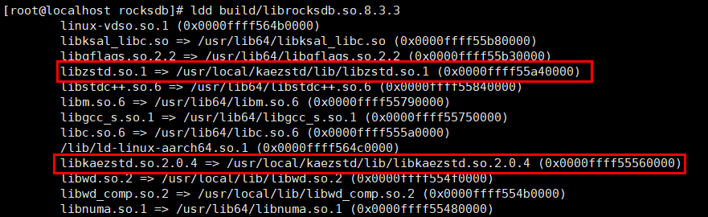

# 安装指南<a name="ZH-CN_TOPIC_0000002521559456"></a>

## 环境要求<a name="ZH-CN_TOPIC_0000002551682863"></a>

本文基于鲲鹏服务器和openEuler、Debian操作系统提供指导，在正式操作前请确保软硬件均满足要求。

**硬件要求<a name="zh-cn_topic_0000001217080138_section10273165810425"></a>**

| 项目    | 规格                                              |
|-------|-------------------------------------------------|
| CPU型号 |<ul><li>华为鲲鹏920处理器</li><li>华为鲲鹏920新型号处理器</li><li>华为鲲鹏950处理器</li></ul> |

**软件要求<a name="section1240364411598"></a>**

| 项目      | 版本                                                                              |
|---------|---------------------------------------------------------------------------------|
| 操作系统    | <ul><li>openEuler 22.03 LTS SP1</li><li>openEuler 22.03 LTS SP2 </li><li>Debian GNU/Linux 10</li></ul> |
| RocksDB | <ul><li>6.1.2 </li><li> 7.9.2 </li><li> 8.3.3</li></ul>                                                   |

**获取软件包<a id="section13411942256"></a>**

| 软件包名称                    | 说明                                                                    | 获取路径                                                                                                                                                                                                             |
|--------------------------|-----------------------------------------------------------------------|------------------------------------------------------------------------------------------------------------------------------------------------------------------------------------------------------------------|
| BoostKit-KSAL_1.10.0.zip | KSAL闭源算法包，用于获取鲲鹏加速特性                                                  | [鲲鹏社区](https://www.hikunpeng.com/developer/download?zhTitle=%E5%88%86%E5%B8%83%E5%BC%8F%E5%AD%98%E5%82%A8&zhSubTitle=%E5%AD%98%E5%82%A8%E7%AE%97%E6%B3%95%E5%8A%A0%E9%80%9F%E5%BA%93&enTitle=SDS&enSubTitle=KSA) |
| KAE-kae2.zip             | KAE源码包，用于安装KAE驱动、KAEZstd（当前KAE2.0适用于openEuler 5.1x内核、Debian 5.15.x内核） | [开源社区](https://gitcode.com/boostkit/KAE/tree/kae2)                                                                                                                                                               |

> **说明：** 
> 
>KSAL是华为自研闭源算法库，KAE是基于鲲鹏处理器提供的硬件加速解决方案，仅支持华为鲲鹏处理器使用。

## 安装KSAL闭源算法包<a name="ZH-CN_TOPIC_0000002520522882"></a>

鲲鹏存储加速库KSAL是华为自研的存储算法加速库，当前提供存储CRC、EC、预取算法等加速软件包，采用鲲鹏优化的算法代替主流开源算法，提升存储性能。

RocksDB读写流程中存在一些热点函数，如CRC、memcpy等，使用优化的算法可以有效提升RocksDB的读写性能。

1. 参见[获取软件包](#section13411942256)获取BoostKit-KSAL\_1.10.0.zip，放置于`/home`目录下。
2. 在`/home`目录下面解压BoostKit-KSAL\_1.10.0.zip。

    ```sh
    cd /home
    unzip BoostKit-KSAL_1.10.0.zip
    ```

3. 安装解压的RPM包。

    ```sh
    rpm -ivh /home/libksal-release-1.10.0.oe1.aarch64.rpm
    ```

4. 确认RPM安装情况。

    ```sh
    rpm -qi libksal
    ```

    显示如下：

    ```txt
    Name        : libksal
    Version     : 1.10.0
    Release     : 1
    Architecture: aarch64
    Install Date: Wed 12 Feb 2025 03:25:39 PM CST
    Group       : Unspecified
    Size        : 808257
    License     : GPL
    Signature   : (none)
    Source RPM  : libksal-1.10.0-1.src.rpm
    Build Date  : Mon 16 Dec 2024 02:50:00 PM CST
    Build Host  : buildhost
    Summary     : Kunpeng Storage Acceleration Library
    Description :
    Kunpeng Storage Acceleration Library
    Product Name:           Kunpeng BoostKit
    Product Version:        24.0.0
    Component Name:         BoostKit-KSAL
    Component Version:      1.10.0
    Component AppendInfo:   kunpeng
    ```


## 安装KAEZstd算法<a name="ZH-CN_TOPIC_0000002520522886"></a>

### openEuler<a name="ZH-CN_TOPIC_0000002551722885"></a>

RocksDB写场景中，当写入数据达到一定数量时，后台线程需要进行数据compaction操作，若compaction操作过慢时，会产生写停现象，导致数据暂时无法继续写入。在compaction过程中会调用压缩算法进行数据压缩，优化压缩算法能够有效提高compaction效率，从而提高RocksDB写性能。

鲲鹏加速引擎KAE（Kunpeng Accelerator Engine）是基于鲲鹏920处理器提供的硬件加速解决方案，其中包含了KAE加解密、KAEZip、KAELz4和KAEZstd。当RocksDB使用zstd作为compaction过程中的压缩算法时，使用KAEZstd可以对其压缩过程进行加速。

1. License申请和安装，具体操作请参见《[华为服务器iBMC许可证 使用指导](https://support.huawei.com/enterprise/zh/management-software/ibmc-pid-8060757?category=operation-maintenance)》。

2. 参见[获取软件包](#section13411942256)获取KAE-kae2.zip，放置于`/home`目录下。

3. 在`/home`目录下解压KAE-kae2.zip，进入KAE源码包目录。

    ```sh
    cd /home
    unzip KAE-kae2.zip
    cd KAE-kae2
    ```

4. 安装依赖。

    ```sh
    yum install -y numactl-devel pciutils openssl-devel automake m4 perl libtool zlib lzma lz4 make patch
    yum install -y kernel-devel-5.10.0-216.0.0.115.oe2203sp4.aarch64
    ```

    > **说明：** 
    >
    >安装kernel-devel时，使用`uname -r`查询当前内核版本，kernel-devel必须与当前内核版本一致。

5. 在KAE源码包目录中请参见以下步骤分模块进行安装。
    1. 安装内核驱动。
        1. 执行以下命令安装内核驱动。

            ```sh
            sh build.sh driver
            ```

        2. 执行以下命令查看是否存在加速引擎文件系统。

            ```sh
            ll /sys/class/uacce/
            ```

            回显信息如下。

            ```txt
            lrwxrwxrwx. 1 root root 0 Aug 22 17:14 hisi_hpre-2 -> ../../devices/pci0000:78/0000:78:00.0/0000:79:00.0/uacce/hisi_hpre-2
            lrwxrwxrwx. 1 root root 0 Aug 22 17:14 hisi_hpre-3 -> ../../devices/pci0000:b8/0000:b8:00.0/0000:b9:00.0/uacce/hisi_hpre-3
            lrwxrwxrwx. 1 root root 0 Aug 22 17:14 hisi_sec2-0 -> ../../devices/pci0000:74/0000:74:01.0/0000:76:00.0/uacce/hisi_sec2-0
            lrwxrwxrwx. 1 root root 0 Aug 22 17:14 hisi_sec2-1 -> ../../devices/pci0000:b4/0000:b4:01.0/0000:b6:00.0/uacce/hisi_sec2-1
            lrwxrwxrwx. 1 root root 0 Aug 22 17:14 hisi_zip-4 -> ../../devices/pci0000:74/0000:74:00.0/0000:75:00.0/uacce/hisi_zip-4
            lrwxrwxrwx. 1 root root 0 Aug 22 17:14 hisi_zip-5 -> ../../devices/pci0000:b4/0000:b4:00.0/0000:b5:00.0/uacce/hisi_zip-5
            ```

        3. 执行以下命令查看驱动安装情况判断驱动是否安装成功。

            ```sh
            lsmod | grep uacce
            ```

            回显信息如下。

            ```sh
            uacce                  32768  3 hisi_sec2,hisi_qm,hisi_zip
            ```

    2. 安装用户态驱动。
        1. 执行以下命令安装用户态驱动。

            ```sh
            sh build.sh uadk
            ```

        2. 执行以下命令查看用户驱动是否安装成功。

            ```sh
            ll /usr/local/lib/libwd*
            ```

            回显信息如下。

            ```sh
            -rwxr-xr-x. 1 root root     961 Aug 22 17:23 /usr/local/lib/libwd_comp.la
            lrwxrwxrwx. 1 root root      19 Aug 22 17:23 /usr/local/lib/libwd_comp.so -> libwd_comp.so.2.6.0
            lrwxrwxrwx. 1 root root      19 Aug 22 17:23 /usr/local/lib/libwd_comp.so.2 -> libwd_comp.so.2.6.0
            -rwxr-xr-x. 1 root root  377872 Aug 22 17:23 /usr/local/lib/libwd_comp.so.2.6.0
            -rwxr-xr-x. 1 root root     973 Aug 22 17:23 /usr/local/lib/libwd_crypto.la
            lrwxrwxrwx. 1 root root      21 Aug 22 17:23 /usr/local/lib/libwd_crypto.so -> libwd_crypto.so.2.6.0
            lrwxrwxrwx. 1 root root      21 Aug 22 17:23 /usr/local/lib/libwd_crypto.so.2 -> libwd_crypto.so.2.6.0
            -rwxr-xr-x. 1 root root  715616 Aug 22 17:23 /usr/local/lib/libwd_crypto.so.2.6.0
            -rwxr-xr-x. 1 root root     907 Aug 22 17:23 /usr/local/lib/libwd.la
            lrwxrwxrwx. 1 root root      14 Aug 22 17:23 /usr/local/lib/libwd.so -> libwd.so.2.6.0
            lrwxrwxrwx. 1 root root      14 Aug 22 17:23 /usr/local/lib/libwd.so.2 -> libwd.so.2.6.0
            -rwxr-xr-x. 1 root root 1342080 Aug 22 17:23 /usr/local/lib/libwd.so.2.6.0
            ```

    3. 编译安装KAEZstd。
        1. 执行以下命令安装KAEZstd。

            ```sh
            sh build.sh zstd
            ```

        2. 执行以下命令查看KAEZstd是否安装成功。

            ```sh
            ll /usr/local/kaezstd/
            ```

            回显信息如下表示安装成功。

            ```txt
            drwxr-xr-x 2 root root 4096 Jun 11 22:29 bin
            drwxr-xr-x 2 root root 4096 Jun 11 22:29 include
            drwxr-xr-x 3 root root 4096 Jun 11 22:29 lib
            drwxr-xr-x 3 root root 4096 Jun 11 22:29 share
            ```

        3. 执行以下命令查看生成的文件。

            ```sh
            ll /usr/local/kaezstd/bin/
            ```

            回显信息如下。

            ```txt
            lrwxrwxrwx 1 root root      4 Jun 11 22:29 unzstd -> zstd
            -rwxr-xr-x 1 root root 986192 Jun 11 22:29 zstd
            lrwxrwxrwx 1 root root      4 Jun 11 22:29 zstdcat -> zstd
            -rwxr-xr-x 1 root root   3869 Jun 11 22:29 zstdgrep
            -rwxr-xr-x 1 root root     30 Jun 11 22:29 zstdless
            lrwxrwxrwx 1 root root      4 Jun 11 22:29 zstdmt -> zstd
            ```

6. 通过查看硬件设备的队列数来确定程序是否已经调用KAE来加速zstd算法，执行以下命令查看hisi\_zip驱动模块对应的队列数，默认情况下队列数为256。

    ```sh
    watch -n 0.2 cat /sys/class/uacce/hisi_zip-*/available_instances
    ```

    回显信息：

    ```txt
    Every 0.2s: cat /sys/class/uacce/hisi_zip-0/available_instances/sys/class/uacce/hisi_zip...  localhost.localdomain:
    256
    256
    256
    256
    ```

    另开窗口执行[功能测试](#section1)，执行任务时若上述回显中队列数量发生变化，表明KAE压缩加速硬件成功使能。

    ```txt
    Every 0.2s: cat /sys/class/uacce/hisi_zip-0/available_instances/sys/class/uacce/hisi_zip...  localhost.localdomain:
    256
    254
    256
    256
    ```


### Debian<a name="ZH-CN_TOPIC_0000002520682866"></a>

RocksDB写场景中，当写入数据达到一定数量时，后台线程需要进行数据compaction操作，若compaction操作过慢时，会产生写停现象，导致数据暂时无法继续写入。在compaction过程中会调用压缩算法进行数据压缩，优化压缩算法能够有效提高compaction效率，从而提高RocksDB写性能。

鲲鹏加速引擎KAE（Kunpeng Accelerator Engine）是基于鲲鹏920处理器提供的硬件加速解决方案，其中包含了KAE加解密、KAEZip和KAEZstd。当RocksDB使用zstd作为compaction过程中的压缩算法时，使用KAEZstd可以对其压缩过程进行加速。

1. License申请和安装，具体操作请参见《[华为服务器iBMC许可证 使用指导](https://support.huawei.com/enterprise/zh/management-software/ibmc-pid-8060757?category=operation-maintenance)》。

2. 参见[获取软件包](#section13411942256)获取KAE-kae2.zip，放置于`/home`目录下。

3. 在`/home`目录下解压KAE-kae2.zip，进入KAE源码包目录。

    ```sh
    cd /home
    unzip KAE-kae2.zip
    cd KAE-kae2
    ```

4. 安装依赖。

    ```sh
    apt install -y autoconf automake libtool m4 pkg-config dh-autoreconf libnuma-dev cmake dracut make liblz4-dev
    ```

5. 在KAE源码包目录中请参见以下步骤分模块进行安装。
    1. 安装内核驱动。
        1. 执行以下命令安装内核驱动。

            ```sh
            bash build.sh driver
            ```

            > **说明：** 
            > 
            >若当前内核在编译时未启用curve25519相关模块而出现报错，可参考[commit-eea16ad4](https://gitcode.com/boostkit/KAE/commit/eea16ad40e2defdaeb3bfc05d5dfc8b77b8b1798?ref=dev_kae2_forByteDance)进行修改。

        2. 执行以下命令查看是否存在加速引擎文件系统。

            ```sh
            ll /sys/class/uacce/
            ```

            回显信息如下。

            ```txt
            lrwxrwxrwx. 1 root root 0 Aug 22 17:14 hisi_hpre-2 -> ../../devices/pci0000:78/0000:78:00.0/0000:79:00.0/uacce/hisi_hpre-2
            lrwxrwxrwx. 1 root root 0 Aug 22 17:14 hisi_hpre-3 -> ../../devices/pci0000:b8/0000:b8:00.0/0000:b9:00.0/uacce/hisi_hpre-3
            lrwxrwxrwx. 1 root root 0 Aug 22 17:14 hisi_sec2-0 -> ../../devices/pci0000:74/0000:74:01.0/0000:76:00.0/uacce/hisi_sec2-0
            lrwxrwxrwx. 1 root root 0 Aug 22 17:14 hisi_sec2-1 -> ../../devices/pci0000:b4/0000:b4:01.0/0000:b6:00.0/uacce/hisi_sec2-1
            lrwxrwxrwx. 1 root root 0 Aug 22 17:14 hisi_zip-4 -> ../../devices/pci0000:74/0000:74:00.0/0000:75:00.0/uacce/hisi_zip-4
            lrwxrwxrwx. 1 root root 0 Aug 22 17:14 hisi_zip-5 -> ../../devices/pci0000:b4/0000:b4:00.0/0000:b5:00.0/uacce/hisi_zip-5
            ```

        3. 执行以下命令查看驱动安装情况判断驱动是否安装成功。

            ```sh
            lsmod | grep uacce
            ```

            回显信息如下。

            ```txt
            uacce                  32768  3 hisi_sec2,hisi_qm,hisi_zip
            ```

    2. 安装用户态驱动。
        1. 执行以下命令安装用户态驱动。

            ```sh
            bash build.sh uadk
            ```

        2. 执行以下命令查看用户驱动是否安装成功。

            ```sh
            ll /usr/local/lib/libwd*
            ```

            回显信息如下。

            ```txt
            -rwxr-xr-x. 1 root root     961 Aug 22 17:23 /usr/local/lib/libwd_comp.la
            lrwxrwxrwx. 1 root root      19 Aug 22 17:23 /usr/local/lib/libwd_comp.so -> libwd_comp.so.2.6.0
            lrwxrwxrwx. 1 root root      19 Aug 22 17:23 /usr/local/lib/libwd_comp.so.2 -> libwd_comp.so.2.6.0
            -rwxr-xr-x. 1 root root  377872 Aug 22 17:23 /usr/local/lib/libwd_comp.so.2.6.0
            -rwxr-xr-x. 1 root root     973 Aug 22 17:23 /usr/local/lib/libwd_crypto.la
            lrwxrwxrwx. 1 root root      21 Aug 22 17:23 /usr/local/lib/libwd_crypto.so -> libwd_crypto.so.2.6.0
            lrwxrwxrwx. 1 root root      21 Aug 22 17:23 /usr/local/lib/libwd_crypto.so.2 -> libwd_crypto.so.2.6.0
            -rwxr-xr-x. 1 root root  715616 Aug 22 17:23 /usr/local/lib/libwd_crypto.so.2.6.0
            -rwxr-xr-x. 1 root root     907 Aug 22 17:23 /usr/local/lib/libwd.la
            lrwxrwxrwx. 1 root root      14 Aug 22 17:23 /usr/local/lib/libwd.so -> libwd.so.2.6.0
            lrwxrwxrwx. 1 root root      14 Aug 22 17:23 /usr/local/lib/libwd.so.2 -> libwd.so.2.6.0
            -rwxr-xr-x. 1 root root 1342080 Aug 22 17:23 /usr/local/lib/libwd.so.2.6.0
            ```

    3. 编译安装KAEZstd。
        1. 执行以下命令安装KAEZstd。

            ```sh
            bash build.sh zstd
            ```

        2. 执行以下命令查看KAEZstd是否安装成功。

            ```sh
            ll /usr/local/kaezstd/
            ```

            回显信息如下表示KAEZstd安装成功。

            ```txt
            drwxr-xr-x 2 root root 4096 Jun 11 22:29 bin
            drwxr-xr-x 2 root root 4096 Jun 11 22:29 include
            drwxr-xr-x 3 root root 4096 Jun 11 22:29 lib
            drwxr-xr-x 3 root root 4096 Jun 11 22:29 share
            ```

        3. 执行以下命令查看生成的文件。

            ```sh
            ll /usr/local/kaezstd/bin/
            ```

            回显信息如下。

            ```txt
            lrwxrwxrwx 1 root root      4 Jun 11 22:29 unzstd -> zstd
            -rwxr-xr-x 1 root root 986192 Jun 11 22:29 zstd
            lrwxrwxrwx 1 root root      4 Jun 11 22:29 zstdcat -> zstd
            -rwxr-xr-x 1 root root   3869 Jun 11 22:29 zstdgrep
            -rwxr-xr-x 1 root root     30 Jun 11 22:29 zstdless
            lrwxrwxrwx 1 root root      4 Jun 11 22:29 zstdmt -> zstd
            ```

6. 通过查看硬件设备的队列数来确定程序是否已经调用KAE来加速zstd算法，执行以下命令查看hisi\_zip驱动模块对应的队列数，默认情况下队列数为256。

    ```sh
    watch -n 0.2 cat /sys/class/uacce/hisi_zip-*/available_instances
    ```

    回显信息：

    ```txt
    Every 0.2s: cat /sys/class/uacce/hisi_zip-0/available_instances/sys/class/uacce/hisi_zip...  localhost.localdomain:
    256
    256
    256
    256
    ```

    另开窗口执行[db_bench功能测试](#section1)，执行任务时若上述回显中队列数量发生变化，表明KAE压缩加速硬件成功使能。

    ```txt
    Every 0.2s: cat /sys/class/uacce/hisi_zip-0/available_instances/sys/class/uacce/hisi_zip...  localhost.localdomain:
    256
    254
    256
    256
    ```


## 编译安装RocksDB<a name="ZH-CN_TOPIC_0000002520682864"></a>

### openEuler<a name="ZH-CN_TOPIC_0000002551722883"></a>

本章节基于RocksDB 6.1.2和8.3.3版本介绍如何编译并安装RocksDB，以下步骤以RocksDB 8.3.3为例进行说明。

1. 安装依赖。

    ```sh
    yum install -y cmake gcc gcc-c++ gflags-devel libstdc++-devel zstd-devel
    ```

2. 获取RocksDB源码并合入补丁。

   ```sh
   git clone https://github.com/facebook/rocksdb.git
   cd rocksdb
   git checkout 791a7fe4023ac795072a9e0cbfc679a3764a2ba0
   wget https://gitcode.com/boostkit/rocksdb/blob/master/rocksdb-8.3.3-kae_zstd.patch
   git apply rocksdb-8.3.3-kae_zstd.patch
   ```

3. 单元测试。

    ```sh
    sh build.sh UTONLY
    ```

    执行成功如下图所示：

    

4. 以Release模式编译RocksDB。

    ```sh
    sh build.sh
    ```

    - build.sh默认编译Release版本，可追加指定编译模式，指定编译模式为`Debug`/`RelWithDebInfo`/`Release`，如执行以下命令。

        ```sh
        sh build.sh Release
        ```

    - build.sh默认使能全部鲲鹏加速特性，其中包括KSAL、KAEZstd算法加速，如果不需要相关特性，可执行以下命令追加选项以关闭KSAL和KAEZstd算法加速。

        ```sh
        sh build.sh Release DISABLE_KSAL DISABLE_KAEZSTD
        ```

        - `DISABLE_KSAL`表示不使能KSAL算法加速。
        - `DISABLE_KAEZSTD`表示不使能KAEZstd算法加速。

5. 编译完成后，执行以下指令查看是否使能相关特性。

    ```sh
    ldd build/librocksdb.so.8.3.3
    ```

    - 回显包含以下信息表示已使能KSAL鲲鹏加速算法库。

        

    - 回显包含以下信息表示已使能KAEZstd加速特性。

        

6. 安装RocksDB。

    ```sh
    cd build
    make install
    ```

7. 性能测试。

    ```sh
    cd ../script
    sh test_perf_all.sh
    ```

    执行结束以后，可在`rocksdb/test_data`目录下查看性能数据。

    > **说明：** 
    >全量用例执行需10小时左右，可通过修改第8行kv大小，第13行db数量，调整用例执行时间或修改用例。默认读写路径为`/mnt/rocksdb_data/test`，如需修改可编辑脚本`test_perf_all.sh`第二行basedir至指定路径，执行前请确保该路径存在。
    >如需将设备挂载至指定路径，执行下述指令，其中nvme0n1根据具体设备名称修改。
>
    >```sh
    >mkfs.ext4 /dev/nvme0n1
    >mount /dev/nvme0n1 /mnt/rocksdb_data/test
    >```

### Debian<a name="ZH-CN_TOPIC_0000002520522884"></a>

本章节主要介绍如何基于RocksDB 6.1.2版本编译并安装RocksDB。

1. 安装依赖。

    ```sh
    apt install -y libsnappy-dev libzstd-dev liblz4-dev libgflags-dev libbison-dev make
    ```

2. 获取RocksDB源码，并合入补丁。

   ```sh
   git clone https://github.com/facebook/rocksdb.git
   cd rocksdb
   git checkout 2b38e2dd6602a17a2010308580fd5d8c91dea650
   wget https://gitcode.com/boostkit/rocksdb/blob/master/6.1.2-optimization.patch
   git apply 6.1.2-optimization.patch
   ```

3. 以Release模式编译RocksDB。

    ```sh
    bash build.sh
    ```

    > **说明：** 
    >
    >- 编译时需要保证当前的GNU Assembler版本为2.41以上。
    >- build.sh默认编译Release版本，可追加指定编译模式，指定编译模式为Debug、RelWithDebInfo、Release，例如执行以下命令选择Release模式。
    >
    >```sh
    >bash build.sh Release
    >```

4. 使能特性。
    1. 编译完成后，执行以下指令使能KAEZstd。

        ```sh
        export LD_LIBRARY_PATH=/usr/local/kaezstd/lib:/usr/local/lib:$LD_LIBRARY_PATH
        ```

    2. 执行以下命令，查看是否使能。

        ```sh
        ldd librocksdb.so
        ```

        回显包含以下信息则表示已使能KAEZstd加速特性。

        

5. 安装RocksDB。

    ```sh
    make install
    ```

6. 使用测试工具db\_bench进行功能测试。<a id="section1"></a>

    ```sh
    ./db_bench --compression_type=zstd
    ```

## 修订记录
| 发布日期  | 修改说明       |
|-------|----------|
| 2025-12-30 | 第三次正式发布。 <br> RocksDB编译安装适配Debian。|
| 2024-06-30 | 第二次正式发布。<br> RocksDB支持硬件卸载。|
| 2025-12-30 | 第一次正式发布。|