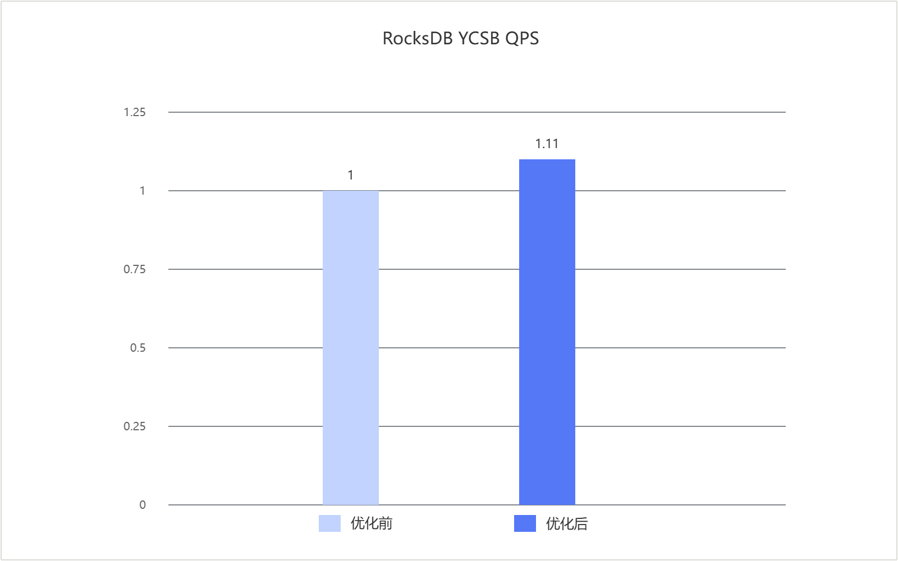

# 内存分配优化特性指南

## 特性描述

### 简介

本文介绍 RocksDB 数据库通过 `kqmalloc` 内存分配器进行内存分配优化的方法、环境要求及验证流程。
RocksDB 作为嵌入式键值存储引擎，读写、缓存、memtable、flush、compaction 等操作会频繁申请和释放内存，容易在分配路径上产生额外开销和并发竞争。因此需要降低内存分配成本，并改善并发场景下的内存管理效率。
本特性不修改 RocksDB 业务代码，通过脚本和链接配置切换进程的内存分配库。可以单独验证，也可以与 GCC 编译优化组合验证。

### 原理描述

RocksDB 作为嵌入式键值存储引擎，在上层应用或测试程序的进程内运行。内存库优化使用 kqmalloc 多线程动态库替换该进程的默认内存分配器，覆盖 RocksDB 在读写、缓存、memtable、flush、compaction 等路径中产生的标准内存分配请求。
kqmalloc 通过线程本地缓存和多级无锁缓存降低小对象分配延迟及并发竞争，通过精细化的大小分级降低内存碎片，并通过透明大页、惰性释放和脏页回收降低 TLB 未命中和页面管理开销。

## 已验证环境

本文基于特定环境提供指导，在正式操作前请确保软硬件均满足要求。

**表 1** 硬件要求

| 项目 | 规格 |
| ---- | ---- |
| CPU | 鲲鹏950处理器 |

**表 2** 操作系统和软件要求<a id="操作系统和软件要求"></a>

| 配置项 | 配置要求 | 获取地址 |
| ----------- | ------------------------------------------------------------ | ------------------------------------------------------------ |
| 操作系统 | openEuler24.03-LTS-SP3 | [获取链接](https://repo.huaweicloud.com/openeuler/openEuler-24.03-LTS-SP3/ISO/aarch64/openEuler-24.03-LTS-SP3-everything-aarch64-dvd.iso) |
| gcc版本 | gcc 12.3.1 | openEuler24.03-LTS-SP3版本自带 |
| Jdk版本 | 1.8.0 | 在openEuler 24.03 LTS SP3系统上，确保网络畅通情况下，利用Yum工具直接安装 |
| RocksDB版本 | 6.26.1 | [获取链接](https://github.com/facebook/rocksdb/tree/v6.26.1) |

## 安装和使用特性

1. 使用 git 克隆 RocksDB 并切换到 6.26.1 版本，放在 $HOME 目录下。

   ```shell
   cd $HOME
   git clone https://github.com/facebook/rocksdb.git
   cd rocksdb/
   git checkout v6.26.1
   ```

2. 安装 yum 依赖和配置环境变量。

   ```shell
   yum install -y git make gcc-c++ snappy snappy-devel zlib zlib-devel bzip2 bzip2-devel lz4 lz4-devel zstd zstd-devel java java-devel java-11-openjdk-devel gflags gflags-devel flex python maven

   export JAVA_HOME=/usr/lib/jvm/java-1.8.0
   export PATH=$JAVA_HOME/bin:$PATH
   ```

3. （可选）获取优化特性的补丁文件，将其上传到 $HOME 目录下。

   获取路径：[RocksDB 6.26.1 feature-patches](https://gitcode.com/boostkit/rocksdb/tree/master/src/rocksdb-6.26.1/feature-patches)。

4. （可选）按照 feature-patches 目录中的实际文件名依次应用0001-0005 相关补丁。如果没有输出则说明合入成功。

   ```shell
   cd $HOME/rocksdb
   patch -p1 < 0001_name_of_patch.patch
   patch -p1 < 0005_name_of_patch.patch
   ```

5. 编译 RocksDB 的 jar 包和相关动态库以使能优化特性。

   5.1 编译 RocksDB 的 jar 包和相关动态库。

   ```shell
   cd "$HOME/rocksdb"
   make clean
   PORTABLE=1 DEBUG_LEVEL=0 make rocksdbjava -j$nproc DISABLE_WARNING_AS_ERROR=1 DISABLE_JEMALLOC=1
   ```

   5.2 替换本地 Maven 仓库中的 jar 包。

   ```shell
   cd "$HOME/rocksdb"
   cp java/target/rocksdbjni-6.26.1-linux64.jar \
      "~/.m2/repository/org/rocksdb/rocksdbjni/6.26.1/rocksdbjni-6.26.1.jar"
   cp java/target/rocksdbjni-6.26.1-linux64.jar.sha1 \
      "~/.m2/repository/org/rocksdb/rocksdbjni/6.26.1/rocksdbjni-6.26.1.jar.sha1"
   ```

6. 获取并编译 kqmalloc 内存库。

   ```shell
   cd $HOME
   git clone https://github.com/boostkit/kqmalloc.git
   cd kqmalloc
   make clean kunpeng
   ```

   编译后的 kqmalloc 库位于 `build/HIP12/lib` 目录。

7. 使用 `LD_PRELOAD` 加载 kqmalloc 内存库并执行性能测试。

   ```shell
   export LD_PRELOAD="$HOME/kqmalloc/build/HIP12/lib/libkqmalloc.so"

   cd "$HOME/YCSB_RUN/YCSB_RUN/ycsb-rocksdb-binding-0.18.0-SNAPSHOT"
   taskset -c 0-15 ./bin/ycsb run rocksdb -s \
   -P workloads/workloada \
   -p fieldlength=256 -p fieldcount=1 \
   -p recordcount=100000000 -p operationcount=100000000 \
   -p rocksdb.dir="$HOME/data/workload_data/" \
   -p rocksdb.optionsfile="$HOME/data/configs/dbsnappyrun.ini" \
   -p rocksdb.cfs=default -p table=default -threads 5
   ```

使用 GCC编译器指令编排优化和内存分配优化特性后，使得 YCSB 的测试工具 workloads a-f 的性能平均提升 11%，优化前后对比效果如[双特性叠加使能前后性能对比](#双特性叠加使能前后性能对比)所示。

**图1** 双特性叠加使能前后性能对比<a id="双特性叠加使能前后性能对比"></a>



## 安全检查与加固

ASLR（Address Space Layout Randomization，地址空间布局随机化）是一种针对缓冲区溢出的安全保护技术，通过对堆、栈、共享库映射等线性区布局的随机化，增加攻击者预测目的地址的难度，防止攻击者直接定位攻击代码位置，达到阻止溢出攻击的目的。

```shell
echo 2 > /proc/sys/kernel/randomize_va_space
cat /proc/sys/kernel/randomize_va_space
```

## 修订记录

| 发布日期 | 修订记录 |
| -------- | -------- |
| 2026-09-30 | 第一次正式发布。 |
