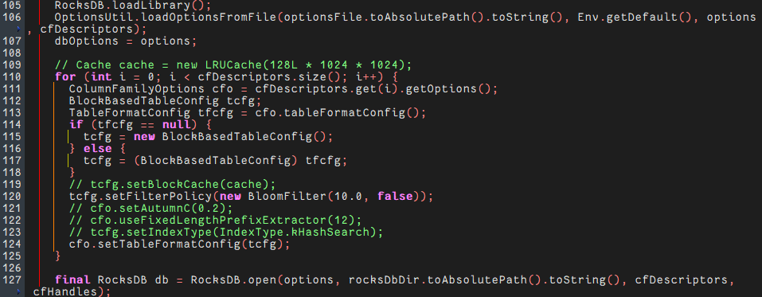
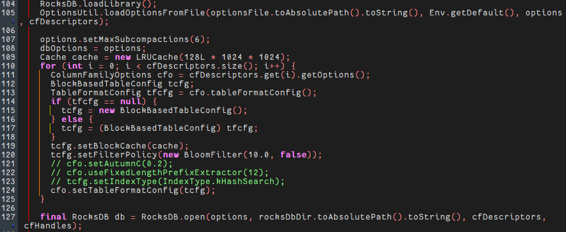

# RocksDB 6.26.1 预取优化 特性指南

## 特性描述

### 简介

本文主要介绍 RocksDB 6.26.1 数据库预取优化特性的优化原理和安装使用方法。

RocksDB 是由Meta（原Facebook）开发的一款高性能、嵌入式、持久化键值存储引擎，基于C++实现，支持嵌入式使用，也可作为客户端-服务器（C/S）模式下的存储数据库。RocksDB采用Log-Structured Merge-Tree（LSM-Tree）数据结构，通过将随机写入转化为顺序写入，显著提升写入吞吐量，尤其适用于高并发写入场景。同时，RocksDB在点查询与范围查询方面也表现出色，广泛应用于数据库、缓存系统及实时数据处理等场景。

在 RocksDB 的 MemTable 跳表和 SST Block 查找中，指针追逐、restart offset 读取及 Key 解码都可能产生缓存未命中，使 CPU 等待内存返回。原有实现只在部分路径进行一跳预取，无法覆盖降层、顺序扫描和二分分支的后续访问。本优化针对 AArch64 平台增加分层和分支感知的预取，在比较当前 Key 的同时请求下一层节点、同层后继以及左右子区间中点，尽量隐藏内存访问延迟并提升读密集场景吞吐。

### 原理描述

本特性通过在数据真正使用前发出缓存预取指令，将内存访问与 Key 比较、restart 二分等计算阶段重叠，降低缓存未命中带来的停顿。预取只影响缓存状态，不改变查找顺序、返回结果或 SST 文件格式；非 AArch64 平台继续沿用原有预取宏。

**跳表指针追逐优化**

在 `memtable/inlineskiplist.h` 的 `FindGreaterOrEqual`、`FindLessThan` 和 `EstimateCount` 循环中，访问当前节点后同时预取 `x->Next(level - 1)` 和 `next->Next(level)`。前者为比较失败后的降层准备低层首节点，后者为同层继续前进准备下下个节点；当前轮 Key 比较期间，内存子系统可以并行搬运这些地址。

**Block 查找预取优化**

在 `table/block_based/block.cc` 中，`IndexBlockIter::SeekImpl` 在二分开始时预取初始中点；`ParseNextDataKey` 和 `ParseNextIndexKey` 在顺序扫描时预取下一条 Key；`BlockIter::BinarySeek` 则在每轮比较时同时计算并预取左右子区间中点。无论下一轮向左还是向右，候选 restart offset 都有机会提前进入缓存，从而减少分支方向造成的额外 Miss。

预取适用于随机 `Get`、`Seek`、范围查询起点定位以及 MemTable 未命中缓存的场景。若工作集已经完全驻留缓存，预取收益有限；实现通过 `#ifdef __aarch64__` 限定指令路径，保持跨平台兼容。

## 环境要求

本文基于特定环境提供指导，在正式操作前请确保软硬件均满足要求。

**表 1** 硬件要求

| 项目 | 规格                                                |
| ---- | --------------------------------------------------- |
| CPU  | Kunpeng920G处理器，仅支持ARM64架构，需要CPU支持SVE2 |
| 内存 | DDR5内存条6400 MT/s 频率，必须满插                  |
| 硬盘 | ES3000 V6 NVMe盘                                    |

**表 2** 操作系统和软件要求<a id="操作系统和软件要求"></a>

| 配置项      | 配置要求                                                     | 获取地址                                                     |
| ----------- | ------------------------------------------------------------ | ------------------------------------------------------------ |
| 操作系统    | openEuler24.03-LTS-SP3                                       | [获取链接](https://repo.huaweicloud.com/openeuler/openEuler-24.03-LTS-SP3/ISO/aarch64/openEuler-24.03-LTS-SP3-everything-aarch64-dvd.iso) |
| 内核版本    | 6.6                                                          | openEuler24.03-LTS-SP3版本自带                               |
| gcc版本     | gcc 12.3.1                                                   | openEuler24.03-LTS-SP3版本自带                               |
| Jdk版本     | 1.8.0                                                        | 在openEuler 24.03 LTS SP3系统上，确保网络畅通情况下，利用Yum工具直接安装 |
| RocksDB版本 | 6.26.1                                                       | [获取链接](https://github.com/facebook/rocksdb/tree/v6.26.1) |
| YCSB版本    | 19e885f7cb780fdded0547853f7810a150554caf                     | [获取链接](https://github.com/brianfrankcooper/YCSB.git)     |
| BOIS配置    | 所有BIOS配置先 load default 调整到默认值，然后power policy 调整至performance性能模式，Hiboost选项调整至Enabled，开启超频模式，其余BIOS配置保持performance power policy下的默认值，包括默认的开启SMT | 进入服务器的BMC系统，进行相应设置。                          |
| patch文件   |          0001_prefetch_opt.patch                   | [获取链接](https://gitcode.com/boostkit/rocksdb/tree/master/src/rocksdb-6.26.1/feature-patches/0001_prefetch_opt.patch) |

## 安装环境

安装和使用该特性需先在RocksDB源码中应用该patch文件，再编译RocksDB。

1. 使用 git 克隆 RocksDB 并切换到 6.26.1 版本，放在主目录“\~”下。

   ```shell
   cd ~
   git clone https://github.com/facebook/rocksdb.git
   cd rocksdb/
   git checkout v6.26.1
   ```

2. 安装yum依赖和环境变量配置。

   ```shell
   yum install -y git make gcc-c++ snappy snappy-devel zlib zlib-devel bzip2 bzip2-devel lz4 lz4-devel zstd zstd-devel java java-devel java-11-openjdk-devel gflags gflags-devel flex python maven
   
   export JAVA_HOME=/usr/lib/jvm/java-1.8.0
   export PATH=$JAVA_HOME/bin:$PATH
   ```

3. 获取优化特性的补丁文件，将其上传到主目录“\~”下。

   获取路径请参见[**表 2** 操作系统和软件要求](#操作系统和软件要求)。

4. 执行以下命令，合入优化特性。如果没有输出则说明合入成功。

   ```shell
   cd ~/rocksdb
   patch -p1 < ~/0001_prefetch_opt.patch
   ```

5. 编译RocksDB的jar包和相关动态库，以使用优化特性。

   1. 修改原生代码在编译jar包和相关动态库时的bug。

      1. 进入修改原生代码路径。

         ```shell
         cd ~/rocksdb
         ```

      2. 打开BlockBasedTableConfig.java文件。

         ```shell
         vim java/src/main/java/org/rocksdb/BlockBasedTableConfig.java
         ```

      3. 按“i”进入编辑模式，修改第38行，将true改为false。(若为false则忽略)

         ```txt
         # 修改第38行，true改为false
         verifyCompression = false;
         ```

      4. 按“Esc”键，输入 **:wq!**，按“Enter”保存并退出编辑。

   2. 编译RocksDB的jar包和相关动态库。

      ```shell
      make clean
      PORTABLE=1 DEBUG_LEVEL=0 make rocksdbjava -j`nproc` DISABLE_WARNING_AS_ERROR=1 DISABLE_JEMALLOC=1
      ```

   3. （可选）若是编译过程中报缺少jar包的错误，可以先清理文件，再手动下载缺少的jar包，然后重新进行编译。

      ```shell
      cd ~/rocksdb
      make clean
      mkdir -p java/test-libs
      cd java/test-libs
      wget https://repo1.maven.org/maven2/org/assertj/assertj-core/1.7.1/assertj-core-1.7.1.jar --no-check-certificate
      wget https://repo1.maven.org/maven2/cglib/cglib/2.2.2/cglib-2.2.2.jar --no-check-certificate 
      wget https://repo1.maven.org/maven2/org/mockito/mockito-all/1.10.19/mockito-all-1.10.19.jar --no-check-certificate
      wget https://repo1.maven.org/maven2/org/hamcrest/hamcrest-core/1.3/hamcrest-core-1.3.jar --no-check-certificate
      wget https://repo1.maven.org/maven2/junit/junit/4.12/junit-4.12.jar --no-check-certificate
      
      ```

   4. 替换本地 Maven 仓库中的 jar 包

      ```shell
      cd ~/rocksdb
      cp java/target/rocksdbjni-6.26.1-linux64.jar \
         ~/.m2/repository/org/rocksdb/rocksdbjni/6.26.1/rocksdbjni-6.26.1.jar
      cp java/target/rocksdbjni-6.26.1-linux64.jar.sha1 \
         ~/.m2/repository/org/rocksdb/rocksdbjni/6.26.1/rocksdbjni-6.26.1.jar.sha1
      ```

   5. 提取原生动态库并设置 `LD_LIBRARY_PATH`

      ```shell
      # 创建库存放目录（供 YCSB 使用）
      mkdir -p ~/Test/rocksdb-lib
      # 清空旧文件
      rm -f ~/Test/rocksdb-lib/*
      # 解压 .so 文件
      unzip -jo ~/.m2/repository/org/rocksdb/rocksdbjni/6.26.1/rocksdbjni-6.26.1.jar "*.so" -d ~/Test/rocksdb-lib
      # 验证
      ls -lh ~/Test/rocksdb-lib/
      # 设置环境变量
      export LD_LIBRARY_PATH=~/Test/rocksdb-lib:$LD_LIBRARY_PATH
      ```

6. 准备 YCSB 双版本并编译（一个用于加载/预热版，一个用于测试版）

   1. 克隆 YCSB 并创建两个副本

      ```shell
      cd ~
      # YCSB 用于加载/预热
      git clone https://github.com/brianfrankcooper/YCSB.git YCSB  
      # YCSB 用于测试
      git clone https://github.com/brianfrankcooper/YCSB.git YCSB_RUN
      # 切换到指定 commit（与之前一致，确保版本稳定）
      cd YCSB && git checkout 19e885f7cb780fdded0547853f7810a150554caf && cd ..
      cd YCSB_RUN && git checkout 19e885f7cb780fdded0547853f7810a150554caf && cd ..
      ```

   2. 修改 pom.xml，统一使用 RocksDB 6.26.1

      ```shell
      # YCSB 加载/预热版
      cd ~/YCSB
      sed -i 's|<rocksdb.version>6.2.2</rocksdb.version>|<rocksdb.version>6.26.1</rocksdb.version>|' pom.xml
      
      # YCSB 测试版
      cd ~/YCSB_RUN
      sed -i 's|<rocksdb.version>6.2.2</rocksdb.version>|<rocksdb.version>6.26.1</rocksdb.version>|' pom.xml
      ```

   3. 按需修改`RocksDBClient.java`，并编译两个版本的YCSB。

      ```shell
      # 进入YCSB源码目录，修改源码（用于加载预热）
      cd ~/YCSB
      vim rocksdb/src/main/java/site/ycsb/db/rocksdb/RocksDBClient.java
      ```

      

      ```shell
      # 进入YCSB_RUN源码目录，修改源码（用于加载预热）
      cd ~/YCSB_RUN
      vim rocksdb/src/main/java/site/ycsb/db/rocksdb/RocksDBClient.java
      ```

      
      
      编译成功后在 ycsb 的 rocksdb/target 目录下会生成 ycsb-rocksdb-binding-0.18.0-SNAPSHOT.tar.gz包，使用 ycsb-rocksdb-binding-0.18.0-SNAPSHOT.tar.gz 即可进行测试，也可以进行解压进行测试。
      
      ```shell
      # 编译加载/预热版
      cd ~/YCSB
      mvn -p1 site.ycsb:rocksdb-binding -am clean package
      # 进行解压
      tar -xzvf rocksdb/target/ycsb-rocksdb-binding-0.18.0-SNAPSHOT.tar.gz
      
       # 编译测试版
      cd ~/YCSB_RUN
      mvn -p1 site.ycsb:rocksdb-binding -am clean package
      # 进行解压
      tar -xzvf rocksdb/target/ycsb-rocksdb-binding-0.18.0-SNAPSHOT.tar.gz
      ```
   
7. 准备数据目录和配置文件

    将RocksDB 配置文件 dbsnappyload.ini 和 dbsnappyrun.ini 放到 configs 目录

   ```shell
   mkdir -p ~/data/workload_data
   mkdir -p ~/data/configs
   cd ~/data/configs
   vim dbsnappyload.ini
   vim dbsnappyrun.ini
   ```

   dbsnappyload.ini 的内容如下：

   ```ini
   # RocksDB 6.26.1 options for YCSB.
   
   
   [Version]
     rocksdb_version=6.26.1
     options_file_version=1.1
   
   # ---------------------------------------------------------------------------
   # LOAD profile (active): initial data load / warm-up data population
   # ---------------------------------------------------------------------------
   
   [DBOptions]
     max_manifest_file_size=67108864
     delete_obsolete_files_period_micros=5400000000
     disableDataSync=false
     use_fsync=true
     max_subcompactions=1
     max_background_compactions=8
     max_background_flushes=4
     max_log_file_size=1073741824
     log_file_time_to_roll=86400
     keep_log_file_num=7
     manifest_preallocation_size=4194304
     allow_os_buffer=true
     allow_mmap_reads=false
     allow_fallocate=true
     stats_dump_period_sec=600
     advise_random_on_open=true
     random_access_max_buffer_size=1048576
     new_table_reader_for_compaction_inputs=true
     compaction_readahead_size=131072
     writable_file_max_buffer_size=1048576
     use_adaptive_mutex=true
     bytes_per_sync=1048576
     delayed_write_rate=5242880
     create_if_missing=true
   
   [CFOptions "default"]
     write_buffer_size=67108864
     max_write_buffer_number=4
     min_write_buffer_number_to_merge=2
     max_write_buffer_number_to_maintain=0
     num_levels=4
     compression_per_level=kNoCompression:kSnappyCompression:kSnappyCompression:kZSTD
     compression_opts=-14:-1:0:0
     level0_file_num_compaction_trigger=6
     level0_slowdown_writes_trigger=32
     level0_stop_writes_trigger=64
     compaction_style=kCompactionStyleLevel
     table_factory=BlockBasedTable
     block_based_table_factory=format_version=4;index_type=kBinarySearch;no_block_cache=false;filter_policy=bloomfilter:10:false;cache_index_and_filter_blocks=false;block_size=8192;block_size_deviation=10;block_restart_interval=16;index_block_restart_interval=16;whole_key_filtering=true;hash_index_allow_collision=true
     target_file_size_base=67108864
     target_file_size_multiplier=1
     max_bytes_for_level_base=1610612736
     level_compaction_dynamic_level_bytes=false
     max_bytes_for_level_multiplier=4
     expanded_compaction_factor=25
     source_compaction_factor=1
     max_grandparent_overlap_factor=10
     soft_pending_compaction_bytes_limit=0
     hard_pending_compaction_bytes_limit=0
     arena_block_size=16777216
     verify_checksums_in_compaction=true
     max_sequential_skip_in_iterations=8
     memtable_prefix_bloom_bits=0
     memtable_prefix_bloom_probes=6
     memtable_prefix_bloom_huge_page_tlb_size=0
     bloom_locality=1
     optimize_filters_for_hits=false
     paranoid_file_checks=false
     compaction_measure_io_stats=false
   
   ```

   dbsnappyrun.ini 的内容如下：

   ```ini
   # RocksDB 6.26.1 options for YCSB.
   
   [Version]
     rocksdb_version=6.26.1
     options_file_version=1.1
   
   
   # ---------------------------------------------------------------------------
   # RUN profile (active): actual YCSB benchmark
   # ---------------------------------------------------------------------------
   
   [DBOptions]
     max_manifest_file_size=67108864
     delete_obsolete_files_period_micros=5400000000
     disableDataSync=false
     use_fsync=true
     max_subcompactions=1
     max_background_compactions=8
     max_background_flushes=4
     max_log_file_size=1073741824
     log_file_time_to_roll=86400
     keep_log_file_num=7
     manifest_preallocation_size=4194304
     allow_os_buffer=true
     allow_mmap_reads=false
     allow_fallocate=true
     stats_dump_period_sec=600
     advise_random_on_open=true
     random_access_max_buffer_size=1048576
     new_table_reader_for_compaction_inputs=true
     compaction_readahead_size=131072
     writable_file_max_buffer_size=1048576
     use_adaptive_mutex=true
     bytes_per_sync=1048576
     delayed_write_rate=5242880
   
   [CFOptions "default"]
     write_buffer_size=402653184
     max_write_buffer_number=4
     min_write_buffer_number_to_merge=2
     max_write_buffer_number_to_maintain=0
     num_levels=4
     compression_per_level=kNoCompression:kSnappyCompression:kSnappyCompression:kZSTD
     compression_opts=-14:-1:0:0
     level0_file_num_compaction_trigger=6
     level0_slowdown_writes_trigger=32
     level0_stop_writes_trigger=64
     compaction_style=kCompactionStyleLevel
     table_factory=BlockBasedTable
     block_based_table_factory=format_version=4;index_type=kBinarySearch;no_block_cache=false;filter_policy=bloomfilter:10:false;cache_index_and_filter_blocks=false;block_size=8192;block_size_deviation=10;block_restart_interval=16;index_block_restart_interval=16;whole_key_filtering=true;hash_index_allow_collision=true
     target_file_size_base=134217728
     target_file_size_multiplier=1
     max_bytes_for_level_base=1610612736
     level_compaction_dynamic_level_bytes=false
     max_bytes_for_level_multiplier=4
     expanded_compaction_factor=25
     source_compaction_factor=1
     max_grandparent_overlap_factor=10
     soft_pending_compaction_bytes_limit=0
     hard_pending_compaction_bytes_limit=0
     arena_block_size=16777216
     verify_checksums_in_compaction=true
     max_sequential_skip_in_iterations=8
     memtable_prefix_bloom_bits=0
     memtable_prefix_bloom_probes=6
     memtable_prefix_bloom_huge_page_tlb_size=0
     bloom_locality=1
     optimize_filters_for_hits=false
     paranoid_file_checks=false
     compaction_measure_io_stats=false
   
   ```

8. 加载数据（使用YCSB目录）

   ```shell
   # 务必清理 pagecache
   echo 3 > /proc/sys/vm/drop_caches
   
   # 进入指定目录，YCSB
   cd ~/YCSB/ycsb-rocksdb-binding-0.18.0-SNAPSHOT
   # 加载命令
   ./bin/ycsb load rocksdb -s -P workloads/workloada \
    -p fieldlength=256 \
    -p fieldcount=1 \
    -p recordcount=100000000 \
    -p operationcount=100000000 \
    -p rocksdb.dir="$HOME/data/workload_data" \
    -p rocksdb.optionsfile="$HOME/data/configs/dbsnappyload.ini" \
    -p rocksdb.cfs=default \
    -p table=default -threads 5
   ```

9. 预热数据（使用YCSB目录）

   ```shell
   cd ~/YCSB/ycsb-rocksdb-binding-0.18.0-SNAPSHOT
   
   LOG="$HOME/data/workload_data/LOG"
   while grep -q "compaction_started" "$LOG"; do
       ./bin/ycsb run rocksdb -s -P workloads/workloadc \
        -p fieldlength=256 \
        -p fieldcount=1 \
        -p recordcount=100000000 \
        -p operationcount=100000000 \
        -p rocksdb.dir="$HOME/data/workload_data" \
        -p rocksdb.optionsfile="$HOME/data/configs/dbsnappyload.ini" \
        -p rocksdb.cfs=default \
        -p table=default \
        -threads 3
   done
   ```

10. 备份预热后的数据集

    如数据集需要重复使用，需要在此时将数据集进行备份，保证后续每次测试的数据集的初始状态一致。

11. 性能测试（使用YCSB_RUN目录）

    使用预热后的数据连续地将workload a-f 各测一次，中间没有drop_cache操作。如果重复测试操作，则需要把之前加载预热的数据给删除，拷贝上之前备份好的数据

    ```shell
    # 进入指定目录，YCSB_RUN
    cd "$HOME/YCSB_RUN/ycsb-rocksdb-binding-0.18.0-SNAPSHOT"

    # 执行 workload A
    taskset -c 0-15 ./bin/ycsb run rocksdb -s \
        -P workloads/workloada \
        -p fieldlength=256 \
        -p fieldcount=1 \
        -p recordcount=100000000 \
        -p operationcount=100000000 \
        -p rocksdb.dir="$HOME/data/workload_data" \
        -p rocksdb.optionsfile="$HOME/data/configs/dbsnappyrun.ini" \
        -p rocksdb.cfs=default \
        -p table=default \
        -threads 5
    
    for x in {a..f}; do
        echo "Running workload${x}"
        taskset -c 0-15 ./bin/ycsb run rocksdb -s \
            -P "workloads/workload${x}" \
            -p fieldlength=256 \
            -p fieldcount=1 \
            -p recordcount=100000000 \
            -p operationcount=100000000 \
            -p rocksdb.dir="$HOME/data/workload_data" \
            -p rocksdb.optionsfile="$HOME/data/configs/dbsnappyrun.ini" \
            -p rocksdb.cfs=default \
            -p table=default \
            -threads 5
    done

    # 如果需要重复测试操作，把之前测试后的数据给删除，拷贝备份数据
    ```

## 安全检查与加固

ASLR（Address Space Layout Randomization，地址空间布局随机化）是一种针对缓冲区溢出的安全保护技术，通过对堆、栈、共享库映射等线性区布局的随机化，增加攻击者预测目的地址的难度，防止攻击者直接定位攻击代码位置，达到阻止溢出攻击的目的。

```bash
echo 2 > /proc/sys/kernel/randomize_va_space
cat /proc/sys/kernel/randomize_va_space
```

## 修订记录

| 发布日期   | 修订记录         |
| ---------- | ---------------- |
| 2026-08-06 | 第一次正式发布。 |
