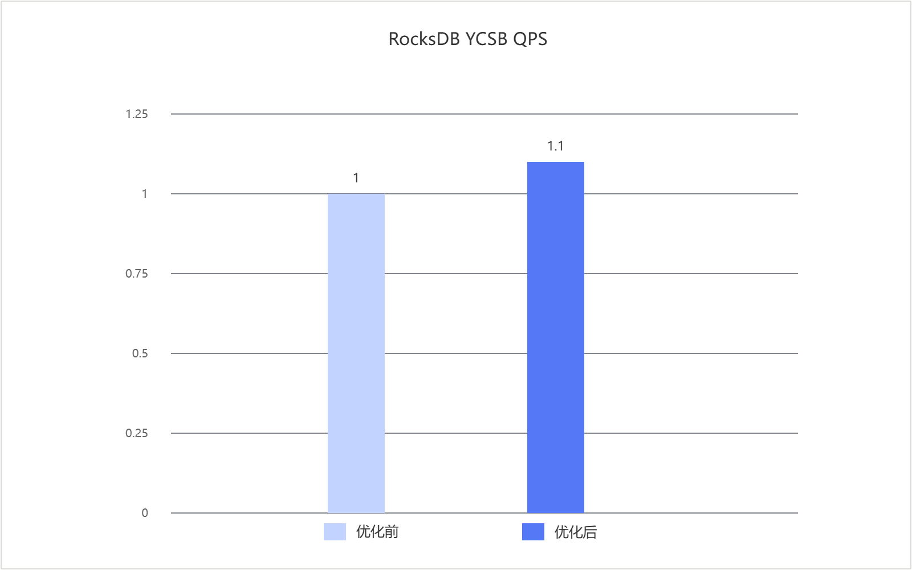

# RocksDB HashSearch优化 特性指南

## 特性描述

### 简介

本文主要介绍RocksDB数据库Index_block HashSearch优化特性的优化原理和安装使用方法。

RocksDB是由Meta（原Facebook）开发的一款高性能、嵌入式、持久化键值存储引擎，基于C++实现，支持嵌入式使用，也可作为客户端-服务器（C/S）模式下的存储数据库。RocksDB采用Log-Structured Merge-Tree（LSM-Tree）数据结构，通过将随机写入转化为顺序写入，显著提升写入吞吐量，尤其适用于高并发写入场景。同时，RocksDB在点查询与范围查询方面也表现出色，广泛应用于数据库、缓存系统及实时数据处理等场景。

在RocksDB从SST文件中查找记录时，HashSearch对候选数据块范围的定位效率直接影响磁盘I/O与CPU开销。传统HashSearch 虽可利用key前缀缩小查找范围，但当前缀配置发生变化、元数据解析语义不一致或block entry 解析开销较高时，可能无法稳定命中HashSearch路径，进而退化为对完整Index Block的二分查找。通过优化前缀配置匹配、HashSearch元数据加载和block解析过程，可以更可靠地利用SST中已有的前缀哈希信息缩小候选范围，减少无效Index Block比较和Data Block读取，并结合ARM64平台解析加速降低热点CPU开销，在一定程度上提升高并发读场景下的查询性能。

### 原理描述

本特性通过优化HashSearch查询路径，缩小目标key的候选数据块查找范围，减少无效的Index Block比较和磁盘I/O，提升RocksDB在鲲鹏950服务器中的整体查询性能与系统稳定性。

在RocksDB中，HashSearch用于根据key的前缀快速定位可能包含目标记录的候选Index Block entry和Data Block，减少对完整Index Block的无效比较以及不必要的磁盘I/O。由于查询操作会频繁经过该路径，候选范围定位的准确性、元数据解析的可靠性和底层解析效率尤为关键。

在保证查询结果正确和SST文件格式兼容的前提下，本特性对HashSearch读路径进行了针对性优化。针对前缀配置变化、HashSearch元数据加载及block解析开销等场景，优化后为不同SST保持稳定的前缀规则，并在查询时判断当前配置是否能够安全使用HashSearch；配置匹配时缩小候选数据块范围，配置不匹配时自动回退普通二分查找，避免错误缩小范围造成漏查。与此同时，对block解析过程进行优化，降低热点路径的访存和计算开销，兼顾性能与稳定性。本优化在HashSearch查询性能、配置兼容性和安全回退之间实现了优化平衡，提升了鲲鹏服务器高并发读场景下的查询吞吐性能。

## 已验证环境

本文基于特定环境提供指导，在正式操作前请确保软硬件均满足要求。

**表 1** 硬件要求

|项目|规格|
|--|--|
|CPU|鲲鹏950处理器|

**表 2** 操作系统和软件要求<a id="操作系统和软件要求"></a>

|项目|版本|获取地址|
|--|--|--|
|操作系统| openEuler 24.03 LTS SP3|[获取链接](https://repo.huaweicloud.com/openeuler/openEuler-24.03-LTS-SP3/ISO/aarch64/openEuler-24.03-LTS-SP3-everything-aarch64-dvd.iso)|
|RocksDB|6.26.1| [获取链接](https://github.com/facebook/rocksdb/tree/v6.26.1) |
|GCC|12.3.1|openEuler 24.03 LTS SP3版本自带|
|Java|11|在openEuler 24.03 LTS SP3系统上，确保网络畅通情况下，利用Yum工具直接安装|
|patch文件|0005_fix_hashsearch_problem.patch|[获取链接](https://gitcode.com/boostkit/rocksdb/tree/master/src/rocksdb-6.26.1/feature-patches/0005_fix_hashsearch_problem.patch)|
|patch文件|0005_fix_hashsearch_problem_independent_test.patch|[获取链接](https://gitcode.com/boostkit/rocksdb/tree/master/src/rocksdb-6.26.1/feature-patches/0005_fix_hashsearch_problem_independent_test.patch)|

## 安装和使用特性

RocksDB index_block HashSearch优化特性针对RocksDB 6.26.1版本进行开发，以patch文件形式提供。安装和使用该特性需先在RocksDB源码中应用该patch文件，再编译RocksDB。

1. 使用git克隆RocksDB并切换到6.26.1版本，放在主目录“\~”下。

   ```shell
   cd ~
   git clone https://github.com/facebook/rocksdb.git
   cd rocksdb/
   git checkout v6.26.1
   ```

2. 安装yum依赖和环境变量配置。

   ```shell
   yum install -y git make gcc-c++ snappy snappy-devel zlib zlib-devel bzip2 bzip2-devel lz4 lz4-devel zstd zstd-devel java java-devel java-11-openjdk-devel gflags gflags-devel flex python maven
   
   export JAVA_HOME=/usr/lib/jvm/java-11
   export PATH=$JAVA_HOME/bin:$PATH
   ```

3. 获取优化特性的补丁文件，将其上传到主目录“\~”下。

   获取路径请参见[**表 2** 操作系统和软件要求](#操作系统和软件要求)。

4. 执行以下命令，合入优化特性。如果没有输出则说明合入成功。

   特别说明：合入0005_fix_hashsearch_problem.patch补丁文件使能之前，需要依次按顺序应用Prefetch预取优化、crc32优化、BloomFilter查找优化、 动态Level容量调整优化对应的0001—0004补丁文件。

   ```shell
   cd ~/rocksdb
   git apply --whitespace=nowarn ~/0005_fix_hashsearch_problem.patch
   ```

     0005_fix_hashsearch_problem_independent_test.patch补丁文件使能，可以直接在RocksDB源码上单独合入使用该优化特性。

   ```shell
   cd ~/rocksdb
   git apply --whitespace=nowarn ~/0005_fix_hashsearch_problem_independent_test.patch
   ```

5. 编译RocksDB的jar包和相关动态库，以使用优化特性。

   1. 编译RocksDB的jar包和相关动态库。

      ```shell
      make clean
      PORTABLE=1 DEBUG_LEVEL=0 make rocksdbjava -j`nproc` DISABLE_WARNING_AS_ERROR=1 DISABLE_JEMALLOC=1
      ```

   2. （可选）若是编译过程中报缺少jar包的错误，可以先清理文件，再手动下载缺少的jar包，然后重新进行编译。

      ```shell
      cd ~/rocksdb
      make clean
      mkdir -p java/test-libs
      cd java/test-libs
      wget https://repo1.maven.org/maven2/org/assertj/assertj-core/2.9.0/assertj-core-2.9.0.jar --no-check-certificate
      wget https://repo1.maven.org/maven2/cglib/cglib/3.3.0/cglib-3.3.0.jar --no-check-certificate 
      wget https://repo1.maven.org/maven2/org/mockito/mockito-all/1.10.19/mockito-all-1.10.19.jar --no-check-certificate
      wget https://repo1.maven.org/maven2/org/hamcrest/hamcrest-core/2.2/hamcrest-core-2.2.jar --no-check-certificate
      wget https://repo1.maven.org/maven2/junit/junit/4.13.1/junit-4.13.1.jar --no-check-certificate
      ```
      
   3. 替换本地Maven仓库中的jar包。

      ```shell
      cd ~/rocksdb
      cp java/target/rocksdbjni-6.26.1-linux64.jar \
         ~/.m2/repository/org/rocksdb/rocksdbjni/6.26.1/rocksdbjni-6.26.1.jar
      cp java/target/rocksdbjni-6.26.1-linux64.jar.sha1 \
         ~/.m2/repository/org/rocksdb/rocksdbjni/6.26.1/rocksdbjni-6.26.1.jar.sha1
      ```

   4. 提取原生动态库并设置`LD_LIBRARY_PATH`。

      ```shell
      # 创建库存放目录（供 YCSB 使用）
      mkdir -p ~/Test/rocksdb-lib
      # 清空旧文件
      rm -f ~/Test/rocksdb-lib/*
      # 解压.so文件
      unzip -jo ~/.m2/repository/org/rocksdb/rocksdbjni/6.26.1/rocksdbjni-6.26.1.jar "*.so" -d ~/Test/rocksdb-lib
      # 验证
      ls -lh ~/Test/rocksdb-lib/
      # 设置环境变量
      export LD_LIBRARY_PATH=~/Test/rocksdb-lib:$LD_LIBRARY_PATH
      ```

      注：以上路径、文件根据实际情况修改。  

6. 执行YCSB测试，验证HashSearch优化特性是否生效。
      使用Prefetch预取优化、crc32优化、BloomFilter查找优化、 动态Level容量调整优化、Index_blocck HashSearch优化，五个特性叠加使得16U规格下YCSB的测试工具workloads a-f的性能平均提升10%，优化前后对比效果如[图 1 五特性叠加使能前后性能对比](#五特性叠加使能前后性能对比)所示。

      **图1** 五特性叠加使能前后性能对比<a id="五特性叠加使能前后性能对比"></a>
      

## 安全检查与加固

ASLR（Address Space Layout Randomization，地址空间布局随机化）是一种针对缓冲区溢出的安全保护技术，通过对堆、栈、共享库映射等线性区布局的随机化，增加攻击者预测目的地址的难度，防止攻击者直接定位攻击代码位置，达到阻止溢出攻击的目的。

```bash
echo 2 > /proc/sys/kernel/randomize_va_space
cat /proc/sys/kernel/randomize_va_space
```


## 修订记录

|文档版本| 发布日期   | 修改说明         |
|----------| ---------- | ---------------- |
|01| 2026-09-30 | 第一次正式发布。 |
