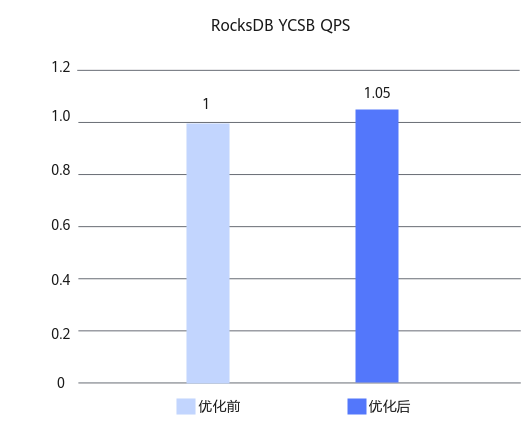

# RocksDB Filter优化 特性指南

## 特性描述<a name="ZH-CN_TOPIC_0000002543719149"></a>

### 简介<a name="ZH-CN_TOPIC_0000002543639153"></a>

本文主要介绍RocksDB数据库Filter优化特性的优化原理和安装使用方法。

RocksDB是由Meta（原Facebook）开发的一款高性能、嵌入式、持久化键值存储引擎，基于C++实现，支持嵌入式使用，也可作为客户端-服务器（C/S）模式下的存储数据库。RocksDB采用Log-Structured Merge-Tree（LSM-Tree）数据结构，通过将随机写入转化为顺序写入，显著提升写入吞吐量，尤其适用于高并发写入场景。同时，RocksDB在点查询与范围查询方面也表现出色，广泛应用于数据库、缓存系统及实时数据处理等场景。

在RocksDB从SST文件中查找记录时，RocksDB布隆过滤器（Bloom Filter）算法的准确性直接影响磁盘IO与CPU的开销。传统固定哈希分布策略对热数据缺乏感知，导致高频访问的数据块仍可能因位图稀疏而误判。通过改进布隆过滤器算法，可以让热数据占据更多bit位来提升热数据的过滤准确率，降低无效磁盘读取，在一定程度上提升性能。

### 原理描述<a name="ZH-CN_TOPIC_0000002512119226"></a>

本特性通过智能布隆过滤器减少无效IO，提升RocksDB在鲲鹏服务器中的整体性能表现与系统稳定性。

**Filter优化<a name="section398327155517"></a>**

在保证系统整体平衡的前提下，本特性对布隆过滤器进行了针对性优化。针对热数据场景，动态增加布隆过滤器中位图（Bitmap）的大小，以提升判断精度，减少误判率；同时设置合理的上限，防止内存占用过度增长，兼顾性能与资源消耗。该优化显著提升了热数据访问下的查询效率。

在RocksDB中，布隆过滤器用于快速判断键是否可能存在于某个SST文件中，有效避免了不必要的磁盘I/O。由于GET操作频繁访问布隆过滤器，其精度与内存开销之间的权衡尤为关键。本优化在精度与内存之间实现了更优平衡，显著提升了热数据场景下的吞吐性能。

## 已验证环境<a name="ZH-CN_TOPIC_0000002512279202"></a>

本文基于特定环境提供指导，在正式操作前请确保软硬件均满足要求。

**表 1** 硬件要求<a id="硬件要求"></a>

|项目|规格|
|--|--|
|CPU|鲲鹏920新型号处理器、鲲鹏950处理器|

**表 2** 操作系统和软件要求<a id="操作系统和软件要求"></a>

|项目|版本|获取地址|
|--|--|--|
|操作系统|openEuler 22.03 LTS SP4|[获取链接](https://repo.huaweicloud.com/openeuler/openEuler-22.03-LTS-SP4/ISO/aarch64/openEuler-22.03-LTS-SP4-everything-aarch64-dvd.iso)|
|操作系统|openEuler 24.03 LTS SP3|[获取链接](https://repo.huaweicloud.com/openeuler/openEuler-24.03-LTS-SP3/ISO/aarch64/openEuler-24.03-LTS-SP3-everything-aarch64-dvd.iso)|
|RocksDB|6.1.2|[获取链接](https://github.com/facebook/rocksdb/tree/v6.1.2)|
|GCC|10.3.1|openEuler 22.03 LTS SP4版本自带|
|Java|1.8.0|在openEuler 22.03 LTS SP4系统上，确保网络畅通情况下，利用Yum工具直接安装|
|patch文件|0002-filter_opt_6_1_2_final.patch|[获取链接](https://gitcode.com/boostkit/rocksdb/blob/rocksdb-v6.1.2-patch/0002-filter_opt_6_1_2_final.patch)|

## 安装和使用特性<a name="ZH-CN_TOPIC_0000002543719151"></a>

RocksDB Filter优化特性针对RocksDB 6.1.2版本进行开发，以patch文件形式提供。安装和使用该特性需先在RocksDB源码中应用该patch文件，再编译RocksDB。

1. 使用git克隆RocksDB并切换到6.1.2版本，放在主目录“\~”下。

    ```shell
    cd ~
    git clone https://github.com/facebook/rocksdb.git
    cd rocksdb/
    git checkout v6.1.2
    ```

2. 安装yum依赖和环境变量配置。

    ```shell
    yum install -y git make gcc-c++ snappy snappy-devel zlib zlib-devel bzip2 bzip2-devel lz4 lz4-devel zstd zstd-devel java java-devel java-11-openjdk-devel gflags gflags-devel flex python maven
    
    export JAVA_HOME=/usr/lib/jvm/java-1.8.0
    export PATH=$JAVA_HOME/bin:$PATH
    ```

3. 获取优化特性的补丁文件，将其上传到主目录“\~”下。

    获取路径请参见[**表 2** 操作系统和软件要求](#操作系统和软件要求)。

4. 执行以下命令，合入优化特性。没有输出则说明合入成功。

    ```shell
    cd ~/rocksdb
    git apply --whitespace=nowarn < ~/0002-filter_opt_6_1_2_final.patch
    ```

5. 编译RocksDB的jar包和相关动态库，以使用优化特性。
    1. 修改原生代码在编译jar包和相关动态库时的bug。
        1. 进入修改原生代码路径。

            ```shell
            cd ~/rocksdb
            ```

        2. 打开BlockBasedTableConfig.java文件。

            ```shell
            vim java/src/main/java/org/rocksdb/BlockBasedTableConfig.java
            ```

        3. 按“i”进入编辑模式，修改第38行，将true改为false。

            ```shell
            # 修改第38行，true改为false
            verifyCompression = false;
            ```

        4. 按“Esc”键，输入 **:wq!**，按“Enter”保存并退出编辑。

    2. 编译RocksDB的jar包和相关动态库。

        ```txt
        PORTABLE=1 DEBUG_LEVEL=0 make rocksdbjava -j`nproc` DISABLE_WARNING_AS_ERROR=1 DISABLE_JEMALLOC=1
        ```

    3. （可选）若是编译过程中报缺少jar包的错误，可以先清理文件，再手动下载缺少的jar包，然后重新进行编译。

        ```shell
        cd ~/rocksdb
        make clean
        mkdir -p java/test-libs
        cd java/test-libs
        wget https://repo1.maven.org/maven2/org/assertj/assertj-core/1.7.1/assertj-core-1.7.1.jar --no-check-certificate
        wget https://repo1.maven.org/maven2/cglib/cglib/2.2.2/cglib-2.2.2.jar --no-check-certificate 
        wget https://repo1.maven.org/maven2/org/mockito/mockito-all/1.10.19/mockito-all-1.10.19.jar --no-check-certificate
        wget https://repo1.maven.org/maven2/org/hamcrest/hamcrest-core/1.3/hamcrest-core-1.3.jar --no-check-certificate
        wget https://repo1.maven.org/maven2/junit/junit/4.12/junit-4.12.jar --no-check-certificate
        ```

6. （可选）通过YCSB工具测试可以得到使能本特性前后的性能提升效果，详细测试步骤请参见《[YCSB测试指导](https://www.hikunpeng.com/document/detail/zh/kunpengdbs/testguide/tstg/kunpengycsbformong_11_0001.html)》。<br>使用RocksDB CRC32优化及RocksDB Filter优化双特性叠加，可以使16U规格下两个用例workloada和workloadc的性能平均提升5%，优化前后对比效果如[**图 1** 双特性叠加使能前后性能对比](#优化特性使能前后性能对比)所示。

    **图 1** 双特性叠加使能前后性能对比<a name="fig1620685015314"></a><a id="优化特性使能前后性能对比"></a><br>
    

## 安全检查与加固<a name="ZH-CN_TOPIC_0000002549283247"></a>

ASLR（Address Space Layout Randomization，地址空间布局随机化）是一种针对缓冲区溢出的安全保护技术，通过对堆、栈、共享库映射等线性区布局的随机化，增加攻击者预测目的地址的难度，防止攻击者直接定位攻击代码位置，达到阻止溢出攻击的目的。

```shell
echo 2 >/proc/sys/kernel/randomize_va_space
```


## 修订记录<a name="ZH-CN_TOPIC_0000002543639155"></a>

|发布日期|修订记录|
|--|--|
|2026-03-30|第一次正式发布。|
