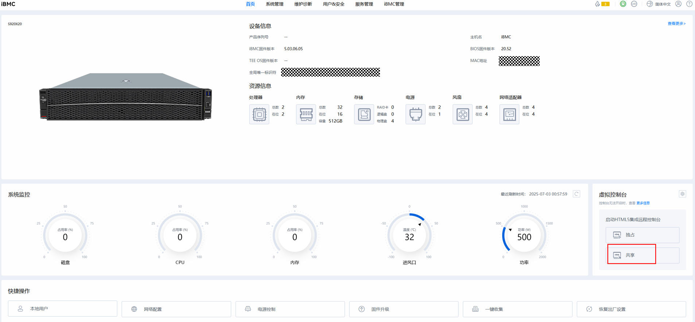
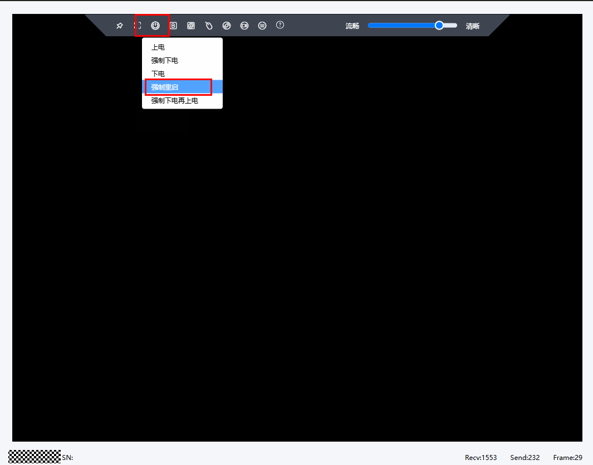
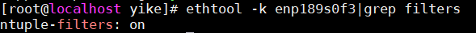
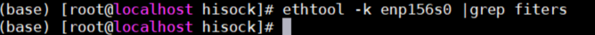

#  RocksDB proxy (Kvrocks) 网络多路径 特性指南

## 特性描述<a name="ZH-CN_TOPIC_0000002512120258"></a>

### 简介<a name="ZH-CN_TOPIC_0000002543640185"></a>

本文主要介绍如何在使用openEuler操作系统的鲲鹏920新型号处理器上搭建使能环境，使能RocksDB proxy（Kvrocks）网络多路径特性和测试性能。

### 原理描述<a name="ZH-CN_TOPIC_0000002543720175"></a>

在互联网业务场景中，一台服务器上通常会部署多个容器业务，每个业务进程通过网络收发业务报文时，网卡中断处理的CPU核与业务进程所在CPU核大多数时候不在相同的NUMA节点，跨NUMA节点的内存访问会导致业务响应时延增加。

RocksDB proxy（Kvrocks）网络多路径特性通过将网卡队列中断按照一定策略绑定到不同NUMA节点的CPU上，同时通过识别特定业务进程的流量特征，将指定业务进程的网络流量优先由当前业务进程所在NUMA上的网卡队列进行接收，从而实现业务进程网络请求与网络中断的亲和性。


### 约束与限制<a name="ZH-CN_TOPIC_0000002543640186"></a>

RocksDB proxy（Kvrocks）网络多路径特性需要网卡支持FDIR（Flow Director）功能。具体查询方法请参见[如何查询网卡是否支持FDIR功能](#如何查询网卡是否支持fdir功能)。

### 应用场景<a name="ZH-CN_TOPIC_0000002543640187"></a>

RocksDB proxy（Kvrocks）网络多路径特性适用于业务网络占比较高的物理机或者容器场景，可将业务进程网络请求与网络中断NUMA亲和调度，提高访存效率，有效提升业务性能。

## 搭建环境<a name="ZH-CN_TOPIC_0000002512280240"></a>

### 环境要求<a name="ZH-CN_TOPIC_0000002512280241"></a>

本文基于鲲鹏服务器和openEuler操作系统提供指导，在正式操作前请确保软硬件均满足要求。

**表 1** 硬件要求<a id="硬件要求"></a>

|项目|规格|
|--|--|
|CPU|鲲鹏920新型号处理器、鲲鹏950处理器|
|网卡|25GE网卡*2|

**表 2** 操作系统和软件要求<a id="操作系统和软件要求"></a>

|项目|版本|获取地址|
|--|--|--|
|操作系统|openEuler 22.03 LTS SP4 for ARM<br>openEuler 24.03 LTS SP3 for ARM|[获取链接](https://repo.openeuler.org/openEuler-22.03-LTS-SP4/ISO/aarch64/openEuler-22.03-LTS-SP4-everything-aarch64-dvd.iso)<br>[获取链接](https://repo.openeuler.org/openEuler-24.03-LTS-SP3/ISO/aarch64/openEuler-24.03-LTS-SP3-everything-aarch64-dvd.iso)|
|Kvrocks|2.2.0|[获取链接](https://github.com/apache/kvrocks/archive/refs/tags/v2.2.0.zip)|
|网络多路径亲和内核|kernel-5.10.0-301.0.0.204.oe2203sp4.aarch64.rpm及以上版本<br>kernel-6.6.0-135.0.0.113.oe2403sp3.aarch64.rpm及以上版本|单击[获取链接](https://repo.openeuler.org/openEuler-22.03-LTS-SP4/update/aarch64/Packages/)，在页面中搜索“kernel-5.10.0”，请在搜索结果中选择最新的内核版本进行下载。内核文件名如kernel-5.10.0-**_xxx_**.0.0.**_xxx_**.oe2203sp4.aarch64.rpm所示，其中xxx越大，代表版本越新。<br>单击[获取链接](https://repo.openeuler.org/openEuler-24.03-LTS-SP3/update/aarch64/Packages/)，在页面中搜索“kernel-6.6.0”，请在搜索结果中选择最新的内核版本进行下载。内核文件名如kernel-6.6.0-**_xxx_**.0.0.**_xxx_**.oe2403sp3.aarch64.rpm所示，其中xxx越大，代表版本越新。|

> **说明：**
>- 后续内容以鲲鹏920新型号处理器、openEuler 22.03 LTS SP4为例进行介绍。<br>
>- 特性支持物理机、容器IPVLAN、容器Host、虚拟机VF网卡直通网络配置场景。<br>
>- 如果OS环境为openEuler内核，要求内核版本为kernel-5.10.0-301.0.0.204及以上。<br>
>- 如果OS环境为非openEuler内核，需要针对性适配网络多路径特性。

### 替换内核<a name="ZH-CN_TOPIC_0000002512280242"></a>

RocksDB proxy（Kvrocks）网络多路径特性（下文简称本特性）需要依赖指定的内核版本，因此需要提前安装具有本特性的OS内核。安装完内核后可通过操作系统内GRUB工具更改内核默认启动项，或通过iBMC远程管理接口选择内核来替换内核，两种方式自行选择一种即可。

#### 使用命令行方式替换

1. 下载支持本特性的内核RPM包，并将其上传到环境。在内核RPM所在目录下执行以下命令进行安装。

    ```shell
    rpm -ivh kernel-5.10.0-301.0.0.204.oe2203sp4.aarch64.rpm --force
    ```

2. 检查已经安装的内核，找出本特性内核的索引号，假设索引号为0。

    ```shell
    grubby --info=ALL | egrep -i 'index|title'
    ```

3. 使用本特性内核的索引号“0”替换默认内核引导条目。

    ```shell
    grubby --set-default-index=0
    ```

4. 查看默认内核，确认已替换成本特性内核。

    ```shell
    grubby --default-kernel
    ```

5. 重启服务器。

    ```shell
    reboot
    ```

#### 使用iBMC方式替换

1. 下载支持本特性的内核RPM包，并将其上传到环境。在内核RPM所在目录下执行以下命令进行安装。

    ```shell
    rpm -ivh kernel-5.10.0-301.0.0.204.oe2203sp4.aarch64.rpm --force
    ```

2. 进入服务器管理平台iBMC。

    **图 1** 进入服务器管理平台iBMC<a name="fig0000000000000001"></a><a id="进入服务器管理平台iBMC"></a><br>
    
    
3. 进入虚拟控制台。

    **图 2** 进入虚拟控制台<a name="fig0000000000000002"></a><a id="进入虚拟控制台"></a><br>
    

4. 强制重启。

    **图 3** 强制重启<a name="fig0000000000000003"></a><a id="强制重启"></a><br>
    

5. 选择网络多路径亲和内核后等待重启完成。

## 使能特性<a name="ZH-CN_TOPIC_0000002512120260"></a><a id="使能特性"></a>

请先进行基础环境配置，再根据实际需求选择合适的使能场景进行使能。

### 配置基础环境<a name="ZH-CN_TOPIC_0000002512120261"></a>

1. 在使能特性之前，在Server端执行以下命令进行基础环境配置。

    ```shell
    systemctl stop firewalld.service
    systemctl disable firewalld.service
    sed -i 's/SELINUX=enforcing/SELINUX=disabled/g' /etc/sysconfig/selinux
    setenforce 0
    systemctl stop irqbalance.service
    systemctl disable irqbalance.service
    swapoff -a
    ```

2. 设置firewalld在退出时清理内核模块。

    ```shell
    sed -i "s/CleanupModulesOnExit=no/CleanupModulesOnExit=yes/g" /etc/firewalld/*.conf
    ```

3. 重启firewalld服务。

    ```shell
    systemctl restart firewalld
    ```

4. 停止firewalld服务。

    ```shell
    systemctl stop firewalld
    ```

### 使能特性<a name="ZH-CN_TOPIC_0000002512120262"></a>

1. 关闭irqbalance。

    ```shell
    systemctl stop irqbalance
    ```

2. RocksDB proxy（Kvrocks）网络多路径特性模块依赖hisi_l3t.ko，需要确认该模块是否已加载。

    ```shell
    lsmod | grep hisi_l3t
    ```

    若上述命令输出为空，则需要加载hisi_l3t.ko。

    ```shell
    modprobe hisi_l3t
    ```
    
    > **说明：**
    >若是在24.03 LTS SP3的操作系统中，则不需要另外加载该模块。

3. 解压oenetcls.ko。

    ```shell
    unxz /usr/lib/modules/5.10.0-301.0.0.204.oe2203sp4.aarch64/kernel/net/oenetcls/oenetcls.ko.xz
    ```

4. 配置网卡信息，启用特性，详细参数说明请参见[表 3](#参数说明)。

    ```shell
    insmod /usr/lib/modules/5.10.0-301.0.0.204.oe2203sp4.aarch64/kernel/net/oenetcls/oenetcls.ko ifname="eth1#eth2" strategy=1
    ```

**表 3** 参数说明<a id="参数说明"></a>

| 参数                  | 说明                                                                                                                                                                                            | 必选/可选 |
| ------------------- | --------------------------------------------------------------------------------------------------------------------------------------------------------------------------------------------- | ----- |
| ifname              | 生效多路径特性的网卡接口名称。支持输入多接口名，网卡接口名称之间通过#间隔。<br><br>示例值：eth1#eth2，其中eth1、eth2为设备名称。                                                                                                                 | 必选    |
| strategy            | 中断绑核亲和策略。<br><br>- 0：缺省策略，将网卡队列中断均分到不同NUMA上，不同网卡使用不同核。<br>- 1：Cluster均分策略，将网卡队列中断均分到不同Cluster上。<br>- 2：NUMA均分策略，将网卡队列中断均分到不同NUMA上，与缺省策略的区别是不同网卡可能使用相同核。<br>- 3：用户自定义网卡中断绑核后，加载多路径模块后自动读取中断信息。 | 必选    |
| debug               | 调试开关。支持动态修改。<br><br>- 0：缺省值，不输出调试日志。<br>- 1：输出调试日志。                                                                                                                                           | 可选    |
| mode                | 运行模式。<br><br>- 0：缺省值，ntuple模式。<br>- 1：flow模式。                                                                                                                                                 | 可选    |
| appname             | 生效多路径特性的进程名称。缺省值为redis-server。<br><br>支持输入多进程名，进程名称之间通过#间隔，取值范围为最大64字节的字符串。                                                                                                                   | 可选    |
| match_ip_flag       | 数据包选择网卡队列时，为避免目的端口冲突，在匹配端口号的基础上，配置是否匹配目的IP地址。支持动态修改。<br><br>- 0：不匹配目的IP地址。<br>- 1：缺省值，匹配目的IP地址。                                                                                               | 可选    |
| irqname             | 指定使用的网卡中断的通用字符串，用于解析指定网卡的终端名。默认值为comp。<br><br>取值范围为最大64字节的字符串                                                                                                                                 | 可选    |
| rxq_multiplex_limit | 在配置网卡接收规则时，每个队列可以被多少tcp数据流复用，适用于网卡队列小于tcp流的场景，取值范围为1~64。默认值为1。                                                                                                                                | 可选    |
| lo_rps_policy       | 本地回环口loopback rps打散开关。RPS的目的是把网卡收到的数据包“分发”给多个CPU核心去处理，从而利用多核优势，避免单个CPU成为瓶颈。<br><br>- 0：关闭功能。<br>- 1：将软中断分散在当前流所在的NUMA节点内。<br>- 2：将软中断分散在当前流所在的cluster节点内内。                    | 可选    |
| rps_policy          | 网卡口rps打散功能。RPS的目的是把网卡收到的数据包“分发”给多个CPU核心去处理，从而利用多核优势，避免单个CPU成为瓶颈。<br><br>- 0：关闭功能。<br>- 1：将软中断分散在当前流所在的NUMA节点内。<br>- 2：将软中断分散在当前流所在的cluster节点内。                      | 可选    |

## 测试性能<a name="ZH-CN_TOPIC_0000002512120263"></a>

### Kvrocks编译安装<a name="ZH-CN_TOPIC_0000002512120264"></a>

RocksDB proxy（Kvrocks）网络多路径特性针对Kvrocks 2.2版本和RocksDB 6.26.1版本进行测试。

1. 安装依赖包。

    ```shell
    yum install -y git make gcc gcc-c++ cmake snappy snappy-devel zlib zlib-devel zlib zlib-devel bzip2 bzip2-devel lz4 lz4-devel zstd zstd-devel sysstat java java-devel gflags gflags-devel flex python maven libstdc++-static
    ```

2. 下载源码包。

    ```shell
    cd /home
    git clone https://github.com/apache/kvrocks.git
    cd kvrocks
    git checkout v2.2.0
    ```

3. 替换RocksDB版本为6.26.1。

    修改“kvrocks/cmake/rocksdb.cmake”文件，指定对应的RocksDB版本号和md5。

    ```shell
    vim cmake/rocksdb.cmake
    ```

    具体修改内容如下：

    ```cmake
    FetchContent_DeclareGitHubWithMirror(rocksdb
        facebook/rocksdb v6.26.1
        MD5=c16e88e7fb78b6cb8ff58cbc02eaa354
    )
    ```

4. 编译。

    ```shell
    ./x.py build -j`nproc`
    ```

    若是x.py执行失败，可能是未被赋予执行权限。

    > **说明：**
    >此时编译可能出现报错，WriteBatchInspector::MarkCommitWithTimestamp函数使用了override，此时只要在kvrocks源码中找到这个函数，去掉override重新编译即可。

5. 运行。

    ```shell
    ./build/kvrocks -c kvrocks.conf
    ```

### YCSB编译安装<a name="ZH-CN_TOPIC_0000002512120265"></a>

YCSB（Yahoo！Cloud Serving Benchmark）是雅虎开发的用来对云服务器进行基础测试的工具，其内部涵盖了常见的NoSQL数据库产品，如Cassandra、MongoDB、HBase、Redis等。在运行YCSB的时候，可以配置不同的workload和DB，也可以指定线程数和并发数等其他参数。

1. 安装依赖包。

    ```shell
    yum install python java maven -y
    ```

2. 下载源码包。

    ```shell
    cd /home
    git clone https://github.com/brianfrankcooper/YCSB.git
    cd YCSB
    git checkout 19e885f7cb780fdded0547853f7810a150554caf
    ```

3. （可选）代理配置。

    若是无法连通maven链接进行下载，可以配置代理。

    创建“~/.m2/settings.xml”，将以下内容写入到文件中：

    ```xml
    <?xml version="1.0" encoding="UTF-8"?>
    <settings xmlns="http://maven.apache.org/SETTINGS/1.0.0"
            xmlns:xsi="http://www.w3.org/2001/XMLSchema-instance"
            xsi:schemaLocation="http://maven.apache.org/SETTINGS/1.0.0 http://maven.apache.org/xsd/settings-1.0.0.xsd">
        <!-- 禁用中央仓库默认HTTPS地址 -->
        <mirrors>
            <mirror>
                <id>insecure-central</id>
                <name>Insecure Central Repository</name>
                <url>https://maven.aliyun.com/repository/public</url>
                <mirrorOf>central</mirrorOf>
            </mirror>
        </mirrors>

        <!-- 允许使用HTTP仓库（安全警告） -->
        <profiles>
            <profile>
                <id>allow-insecure-repositories</id>
                <repositories>
                    <repository>
                        <id>central</id>
                        <url>https://maven.aliyun.com/repository/public</url>
                        <releases>
                            <enabled>true</enabled>
                        </releases>
                        <snapshots>
                            <enabled>false</enabled>
                        </snapshots>
                    </repository>
                </repositories>
                <pluginRepositories>
                    <pluginRepository>
                        <id>central</id>
                        <url>https://maven.aliyun.com/repository/public</url>
                        <releases>
                            <enabled>true</enabled>
                        </releases>
                        <snapshots>
                            <enabled>false</enabled>
                        </snapshots>
                    </pluginRepository>
                </pluginRepositories>
                <properties>
                    <maven.wagon.http.ssl.insecure>true</maven.wagon.http.ssl.insecure>
                    <maven.wagon.http.ssl.allowall>true</maven.wagon.http.ssl.allowall>
                </properties>
            </profile>
        </profiles>

        <proxies>
            <proxy>
                <id>my-proxy</id>  <!-- 代理标识符（任意名称） -->
                <active>true</active>  <!-- 是否启用此代理 -->
                <protocol>http</protocol>  <!-- 代理协议：http/https/socks -->
                <host>IP地址</host>  <!-- 代理服务器地址 -->
                <port>端口号</port>  <!-- 代理端口 -->
            </proxy>
        </proxies>

        <!-- 激活配置 -->
        <activeProfiles>
            <activeProfile>allow-insecure-repositories</activeProfile>
        </activeProfiles>
    </settings>
    ```

    修改其中的IP地址和端口号。

4. 编译。

    ```shell
    mvn -pl site.ycsb:redis-binding -am clean package
    ```

### 性能测试<a name="ZH-CN_TOPIC_0000002512120266"></a>

1. 使能RocksDB proxy（Kvrocks）网络多路径特性。

    1. 根据[**使能特性**](#使能特性)章节配置基础环境，使能RocksDB proxy（Kvrocks）网络多路径特性（仅执行步骤1~步骤3 解压oenetcls.ko即可）。
    2. 手动将网络中断号绑定到每个numa的后16个核上，一个cpu核一个中断号，防止与Kvrocks实例争抢CPU资源。
    3. 启用网络多路径特性。

        ```shell
        insmod /usr/lib/modules/5.10.0-301.0.0.204.oe2203sp4.aarch64/kernel/net/oenetcls/oenetcls.ko mode=1 appname="kvrocks" ifname="网卡名称" strategy=3 debug=0 match_ip_flag=0 irqname="网卡名称" rxq_multiplex_limit=4 lo_rps_policy=2 rps_policy=2
        ```
        
        若是使能成功，在“mode=0”的情况下，启动Kvrocks进程后执行以下命令，能查看网卡是否成功启用网络多路径特性。而“mode=1”的情况暂时无法显式观测到现象。
        
        ```shell
        ethtool -u 网卡名称
        ```
        
        

2. 配置Kvrocks。

    半整机多实例场景下，每个Kvrocks需要绑定16个cpu核和对应numa的内存，于是每个numa有两个Kvrocks实例，整机需部署8个Kvrocks实例。每个实例启动都需要不同的配置文件“kvrocks.conf”。其中workers参数统一设置成16，port和dir两个参数根据实例的不同设置为不同的值。最后，启动8个Kvrocks实例。

3. 使用YCSB进行压测。

    进入YCSB根目录，为每个ycsb工具平均分配相同的cpu核进行压测。以下以单实例为例给定各个场景的测试命令。

    1. 导入500万数据。

        ```shell
        taskset -c 0-15 ./bin/ycsb load redis -s -P ./workloads/workloada -threads 16 -p "redis.host=$HOST" -p "redis.port=$PORT" -p "redis.timeout=0" -p "recordcount=5000000" -p "operationcount=0" -p "maxexecutiontime=0" -p "fieldcount=1"
        ```

    2. QPS，测试300秒的吞吐量。

        ```shell
        taskset -c 0-15 ./bin/ycsb run redis -s -P ./workloads/workloada -threads 128 -p "redis.host=$HOST" -p "redis.port=$PORT" -p "redis.timeout=0" -p "recordcount=5000000" -p "operationcount=0" -p "maxexecutiontime=300" -p "fieldcount=1" -p "readallfields=false" -target 0
        ```

    3. 时延，固定20万QPS测试300秒的时延。

        ```shell
        taskset -c 0-15 ./bin/ycsb run redis -s -P ./workloads/workloada -threads 128 -p "redis.host=$HOST" -p "redis.port=$PORT" -p "redis.timeout=0" -p "recordcount=5000000" -p "operationcount=0" -p "maxexecutiontime=300" -p "fieldcount=1" -p "readallfields=false" -target 200000
        ```

## 恢复环境<a name="ZH-CN_TOPIC_0000002512120267"></a>

### 取消RocksDB proxy（Kvrocks）网络多路径特性<a name="ZH-CN_TOPIC_0000002512120268"></a>

```shell
rmmod oenetcls
systemctl start irqbalance
```

## 安全检查与加固<a name="ZH-CN_TOPIC_0000002549203369"></a>

ASLR（Address Space Layout Randomization，地址空间布局随机化）是一种针对缓冲区溢出的安全保护技术，通过对堆、栈、共享库映射等线性区布局的随机化，增加攻击者预测目的地址的难度，防止攻击者直接定位攻击代码位置，达到阻止溢出攻击的目的。

```shell
echo 2 >/proc/sys/kernel/randomize_va_space
```


## 参考信息<a name="ZH-CN_TOPIC_0000002549203370"></a><a id="如何查询网卡是否支持fdir功能"></a>

执行下述命令查询网卡是否支持FDIR。

```shell
ethtool -k 网卡名 |grep filters
```

- 若输出结果包含ntuple-filters，没有标识[fixed]，则网卡支持FDIR。

    **图 4** ntuple-filters支持FDIR输出示例一<a name="fig0000000000000004"></a><a id="ntuple-filters支持FDIR输出示例一"></a><br>
    

    **图 5** ntuple-filters支持FDIR输出示例二<a name="fig0000000000000005"></a><a id="ntuple-filters支持FDIR输出示例二"></a><br>
    
    
- 若输出为ntuple-filters:off[fixed]，或输出为空，则网卡不支持FDIR。

    **图 6** ntuple-filters不支持FDIR输出示例一<a name="fig0000000000000006"></a><a id="ntuple-filters不支持FDIR输出示例一"></a><br>
    

    **图 7** ntuple-filters不支持FDIR输出示例二<a name="fig0000000000000007"></a><a id="ntuple-filters不支持FDIR输出示例二"></a><br>
    

## 修订记录<a name="ZH-CN_TOPIC_0000002543640188"></a>

|发布日期|修订记录|
|--|--|
|2026-06-30|第一次正式发布。|
